```mermaid
graph TD
    A["Coordinator: Identify Decision Need"] --> B["Coordinator: Structure Mandate<br/>- Who: Identify SMEs<br/>- What: Define question<br/>- Context: Add background<br/>- Deadline: Set expectation"]
    B --> C["Coordinator: Invoke API<br/>POST /mandates<br/>+ SME list<br/>+ question<br/>+ complexity/scope"]
    C --> D{API Validation<br/>Successful?}
    D -->|No| E["Error: Return validation message<br/>- Missing required fields<br/>- Invalid SME identifiers<br/>- Deadline in past"]
    E --> B
    D -->|Yes| F["System: Create Mandate<br/>- Generate mandate ID<br/>- Store metadata<br/>- Calculate mandate weight"]
    F --> G["System: Schedule Outreach<br/>- Immediate: SME 1<br/>- +5min: SME 2<br/>- +10min: SME 3"]
    G --> H["System: Begin Temporal Breathing<br/>Relance Timeline:<br/>- 20min → 1h → 4h → 24h"]
    H --> I["Coordinator: Receive Confirmation<br/>Webhook callback:<br/>mandate_id + status"]
    I --> J{Coordinator: Monitor or<br/>Continue Work?}
    J -->|Monitor| K["Coordinator: View Mandate Status<br/>- Responses received: 2/3<br/>- Pending: Mike (17min)<br/>- Next relance: +3min"]
    J -->|Continue| L["Coordinator: Return to Work<br/>Confident system handles<br/>respectful follow-up"]
    K --> M["Coordinator: Receive Final Report<br/>Webhook callback:<br/>- All responses received<br/>- Report data<br/>- Mandate complete"]
    L --> M
    M --> N["Coordinator: Success<br/>Decision point unblocked"]
```

```mermaid
graph TD
    A["SME: Working, In Focus"] --> B["System: SME Interrupt<br/>Slack Message Received<br/>- Mandate title<br/>- From + context<br/>- Complexity/time estimate<br/>- Due deadline"]
    B --> C["SME: Cognitive Load Check<br/>- Can I understand this?<br/>- Will it take too long?"]
    C --> D{SME: Ready to<br/>Respond?}
    D -->|No: Too Busy| E["SME: Reschedule<br/>Click 'Come back 2h'<br/>System stores preference"]
    E --> F["System: Honor Preference<br/>Relance in 2 hours"]
    F --> G["SME: Return When Ready<br/>Notification resurfaces"]
    G --> C
    D -->|No: Need Info| H["SME: Ask Question<br/>Click 'Need clarification'<br/>Typed follow-up"]
    H --> I["System: Escalate to Coordinator<br/>Send clarification request<br/>with SME context"]
    I --> J["Coordinator: Provide Clarification<br/>Update mandate context"]
    J --> K["SME: Receive Updated Context<br/>Thread-based continuity"]
    K --> C
    D -->|Yes| L["SME: Respond<br/>Select response + optional note:<br/>- ✅ Yes (with context)<br/>- ❌ No (with blocker)<br/>- ❓ Depends (condition)<br/>- 📝 Text response"]
    L --> M["SME: Submit<br/>Click 'Send'"]
    M --> N["System: Acknowledge<br/>Slack message:<br/>✅ Response received<br/>Timestamp + brief summary"]
    N --> O["SME: Closure<br/>Return to focus work<br/>No further notifications"]
    O --> P["System: Record Response<br/>- Store in mandate<br/>- Cancel relances for Marc<br/>- Update coordinator status"]
    P --> Q["Coordinator: Notified<br/>Webhook callback<br/>1 of 3 responses received"]
```

# UX Design Specification ai-interviewer

**Author:** Hoani
**Date:** 2026-01-25

---

## Executive Summary

### Project Vision
**ai-interviewer** collecte asynchronement l'information auprès d'experts via des agents mandatés qui remplacent les réunions coûteuses par des interactions chirurgicales respectueuses du flow cognitif des SMEs (Subject Matter Experts).

**Contexte clé:**
- **Mandataires:** API-first (chatbot/agent LLM possibles), objectif = éviter la "réunionite", tolérance 2h, 5-10 mandats/jour
- **Experts (SMEs):** Répondent via Slack en < 1min réelle de perturbation, perçoivent l'interaction comme "aide vs réunion"
- **Scope:** Multi-entreprise SaaS, API-only pour MVP, pas de branding spécifique

### Target Users

**Decision Coordinators (Mandataires):**
- Roles: PM, Tech Leads, Assistants exécutifs, Chefs de projet
- Pain: "Réunionite" = trop de réunions pour aligner, prises de décision bloquées
- Goal: Mandater l'agent pour collecter l'info asynchronement, décider plus vite
- Usage: 5-10 mandats/jour, tolérance 2h de latence

**Subject Matter Experts (SMEs):**
- Roles: Senior Engineers, Architects, Directors, Subject experts
- Context: Interrompus dans leur flow de travail
- Perception: Peuvent se sentir "harcelés" mais acceptent si positionné comme "aide"
- Capability: Peuvent répondre en < 1min (attention span très limité)
- Flexibility: Peuvent répondre vide/rapide/détaillé, demander du temps pour consulter

### Key Design Challenges & Opportunities

**Design Challenges:**
1. **Mandate Clarity** - Établir légitimité + contexte en < 10 secondes (qui demande? pourquoi? pour quoi décider?)
2. **Verbal Minimalism** - Zéro verbosité, une idée par message, langage chirurgical sans perdre clarté
3. **Flexible Closure** - Accepter réponses vide/rapide/détaillée/consultative sans ambigu
4. **Cognitive Respect** - < 1min perturbation réelle, détecter et adapter selon profil SME
5. **Extreme Robustness** - Gérer refus/silence/hostilité/réponses low-quality gracieusement

**Design Opportunities:**
1. **"Sniper Mandate Protocol"** - Legitimacy as UX differentiator (établir confiance immédiate)
2. **"Mental Load Budgeting"** - Self-adapting verbosity selon profil SME + charge cognitive détectée
3. **"Graceful Flexibility"** - Options explicites pour l'expert (répondre/attendre/refuser)
4. **"Temporal Breathing"** - Smart waits, respect des horaires, no harassment pattern
5. **"Trust Reputation System"** - Learn from interactions, adapt future contact approach

---

## Interaction Architecture: 3 Pillars + 3 Protocols

Basé sur brainstorming session (2026-01-18) utilisant Reversal Inversion + First Principles Thinking, voici l'architecture psychologique de l'interaction SME:

### Pillar 1: THE MANDATE (Établir Légitimité)

**Objectif:** Le SME comprend immédiatement qui le mandate, pourquoi, et accepte l'interaction.

| Élément | Spécification |
|---------|---------------|
| **Identité mandataire** | Prénom seul par défaut (+ rôle si homonyme dans périmètre) |
| **Agent LLM mandataire** | Format: "De la part de [Bot Name] (créé par [Creator/Team])" pour établir chaîne de responsabilité |
| **Traçabilité mandat** | Non imposée au SME; retrouvage en arrière-plan via (mandataire + SME + date approximative) |
| **Consentement implicite** | Silence ≠ refus; relancer 3 fois (20min → 1h → 4h) + 4e relance après 24h |
| **Refus explicite** | Arrêt immédiat, zéro relance, informer coordinator du refus |

**Message Template (Mandate):**
```
De la part de [Prénom].
[Contexte court en 1 phrase: "Nous finalisons un choix architectural pour la migration DB et avons besoin de validation avant de décider."]
Cela nous éviterait une longue réunion.

Première question: [Question claire et directe]
```

### Pillar 2: EMPATHETIC MIRROR (Respecter l'Écologie Cognitive)

**Objectif:** Minimiser la charge mentale du SME tout en collectant l'information complète.

| Élément | Spécification |
|---------|---------------|
| **Structure questions** | Progressive: 1 question à la fois, attendre réponse, puis suivante |
| **Report si charge élevée** | Pré-détection: Status DND (ne JAMAIS envoyer); Post-détection: délai de réponse + ton du message |
| **Réponse courte** | ≠ occupation; peut être une vraie réponse efficace, accepter comme valide |
| **First message length** | ~150 mots (médium): mandate + contexte court + Q1 |
| **Profiling SME** | Adapter longueur first message: Dev (court 80w) / Manager (médium 150w) / CTO (contexte complet 250w) |
| **Détection surcharge** | Combiner: status DND + délai response + ton; proposer report si signe charge |
| **Poids charge cognitive** | Score par question (0-14 points): Périmètre(5) > Complexité(4) > Urgence(3) > Dépendances(2) |
| **Seuils acceptables** | Dev ≤8 / Manager ≤6 / CTO ≤12; excéder = avertir + simplifier + temporiser |
| **Simplification** | Si surcharge détectée: fusionner questions / reformuler plus simple / échelonner sur jours |

### Pillar 3: DETERMINISTIC CLOSURE (Finality Absolue)

**Objectif:** Chaque réponse est définitive, la transaction est close, pas d'ambiguïté.

| Élément | Spécification |
|---------|---------------|
| **Types de réponse acceptés** | Tous 7: directe / détaillée / nuancée / demande info / refus / question retour (si clarif/info facile) / silence après relances |
| **Info "facilement trouvable"** | Hybrid: whitelist first (deadline, tech stack, metrics, budget) + LLM si doute |
| **Question retour SME** | Autorisée SI: (a) clarification sur Q ou (b) info facilement disponible (docs, dashboards) ou (c) remontée au coordinator avec re-ask en parallèle |
| **Structure réponse rapportée** | Enrichie: [Décision] [Confidence level 0-100%] [Risks identifiés] [Dependencies] [Timeline] + [Texte brut en appendix] |
| **"DONE" = moment** | Après confirmation du coordinator (via son canal: API/Slack pour humain, API pour LLM) |
| **Relance après close** | = nouveau mandat distinct (chaque mandat = transaction atomique) |
| **Confirmation coordinator** | Via canal adapté: Slack/API pour humain; API pour agent LLM |
| **Réponse vide/impossible** | Rapporter: "SME couldn't respond" + contexte (silence après relances / explicit refusal / escalation) |
| **"Je dois vérifier X"** | Agent demande délai estimé au SME, SME confirme ou ajuste, reschedule basé sur réponse SME |

---

## Protocol 1: TEMPORAL BREATHING (Respect des Temps & Flow)

**Objectif:** Relancer intelligemment sans harceler, respecter les horaires et priorités du SME.

| Élément | Spécification |
|---------|---------------|
| **Timeline relances initial** | 3 relances: 20min → 1h → 4h |
| **4e relance (grande respiration)** | 24h après 3e relance (dernière chance) |
| **Après 4e relance** | Abandon définitif, marquer comme "non-répondu" |
| **Status Slack explicite** | Pré-check: Ne JAMAIS envoyer si status = DND / In meeting / On vacation / Do Not Disturb |
| **Queue de messages** | Si status indispo: queue le message jusqu'au changement de status |
| **Reschedule (vérification)** | Si SME dit "je vais vérifier X": Agent propose heure ("Je te relance demain 9h?"), SME confirme ou ajuste |
| **Horaires de travail** | Respectés strictement (e.g., lun-ven 9h-17h UTC+1): queue message hors horaires jusqu'à prochaine fenêtre |
| **Timezone awareness** | Respecter timezone SME; ne jamais envoyer dehors de ses heures normales |

**Decision Tree - Relancer ou non:**
```
SME received message?
├─ Yes, responded → Go to Pillar 3 (Closure)
├─ No response in 20min → 1st follow-up
│  ├─ Responded? → Closure
│  └─ No → wait 1h
├─ No response in 1h → 2nd follow-up
│  ├─ Responded? → Closure
│  └─ No → wait 4h
├─ No response in 4h → 3rd follow-up
│  ├─ Responded? → Closure
│  └─ No → wait 24h
└─ No response in 24h → 4th & final follow-up
   ├─ Responded? → Closure
   └─ No → Mark "non-répondu", close mandate
```

---

## Protocol 2: TRANSACTIONAL DE-ESCALATION (Anti-Fragility)

**Objectif:** Gérer les cas difficiles (hostilité, silence, low-quality) gracieusement, maintenir relation.

| Élément | Spécification |
|---------|---------------|
| **Hostilité détectée** | Exemple: "Stop spamming", "Cette question est débile" |
| **Réaction hostilité** | (1) S'excuser; (2) Passer en minimal mode (20-30 mots); (3) Escalade coordinator en parallèle |
| **Minimal mode format** | Ultra-concis (20-30 mots), question seule, zéro contexte: "Valides-tu l'Option B (migration progressive avec sharding)?" |
| **Réponse très courte** | Contextuel: Simple Q (oui/non) → "ok" valide; Complexe Q (détails/reasoning) → demander clarification |
| **Clarification demandée** | Format: "Ok = tu valides? Des risques à mentionner?" + attendre réponse avant continuer |
| **Réponse ambiguë/low-quality** | (1) Demander clarifications spécifiques; (2) Si SME refuse → accepter; (3) Escalade coordinator: "Low-quality response, clarification attempted" |
| **Triggers d'escalade au coordinator** | Hostilité explicite / Refus explicite / Low-quality malgré clarification / SME demande parler au coordinator directement |

**Escalade Message Template:**
```
[Coordinator Name],
Mandat: [Brief description]
Status: [Escalated]
Reason: [Hostility / Refusal / Low-quality / Direct request]
Context: [What happened]
Next steps: [Recommend reapproach / Reassign / Close]
```

---

## Protocol 3: TRUST MARKING (Réputation & Apprentissage)

**Objectif:** Construire profil de confiance du SME, adapter approches futures.

| Élément | Spécification |
|---------|---------------|
| **Signaux positifs (+trust)** | Réponses rapides (< 5min) / Réponses détaillées & structurées / Accepte clarifications / Flexible avec reschedule |
| **Signaux négatifs (-trust)** | Hostilité/agressivité / Refus systématique / Réponses tardives (> 4h) / Low-quality responses |
| **Signaux neutres (0 trust)** | Silence (peut être occupé) / Refus respectueux avec raison / Pas assez d'interactions pour scorer |

**Reputation Impacts:**
- **High trust (+):** Envoyer mandats sans hésiter, profil court, flexible avec relances
- **Low trust (-):** Avertir coordinator avant d'envoyer, minimal mode par défaut, moins de relances
- **Neutral (0):** Traiter standard, monitorer pour évoluer

---

---

## Core User Experience

### Defining Experience

**ai-interviewer** is fundamentally a **transaction loop**: Mandate → Response → Validation.

A mandataire launches a surgical information request ("I need validation on Option B from Marc before our decision"). An SME receives a crystal-clear message on Slack, understands immediately, and responds with minimal effort (ideally one click). The mandataire confirms receipt and the transaction closes—no ambiguity, no loose ends.

The core experience is **complete decisiveness through async clarity**.

### Platform Strategy

**Mandataire Entry Points (MVP):**
- **API** (REST/SDK for developers and agent LLMs to integrate)
- **Chatbot** (conversational interface for non-technical coordinators: "Create mandate: ask Marc if Option B is viable")
- **Agent LLM** (autonomous agents like HR onboarding bots can trigger mandates programmatically)

All three channels funnel to the same backend; no platform lock-in.

**SME Response Channel (MVP):**
- **Slack only** (Socket Mode for reliability, message threading for context)
- **Future Phase 2:** Native web chat (direct communication channel for SME responses)

**Why this strategy?**
- **Mandataire diversity:** Allow any entry point (API/chatbot/LLM) because "where the request comes from" varies widely
- **SME focus:** Slack MVP because it's already in enterprises, high adoption, zero friction; native chat later when scale demands it

### Effortless Interactions

**For SME (Response) - ⭐ HIGHEST PRIORITY:**
- **Receive notification** → Immediately in Slack (< 5 seconds to visible message)
- **Understand mandate** → Clear in < 10 seconds: [Coordinator] mandates [context]. Question: [single question]
- **Respond with one click** → Template buttons preferred: "Yes" / "No" / "Need to check X" / "Can't answer"
- **Optional text** → If more than button is needed, short text acceptable (not required)
- **See confirmation** → Immediate feedback: "Your response was recorded"

**For Mandataire (Launch) - ⭐ HIGH PRIORITY:**
- **Create mandate in < 1 minute** via any channel:
  - **API:** `POST /mandates { coordinator_id, sme_email, question, context }`
  - **Chatbot:** "Create: ask Marc about Option B for migration decision"
  - **LLM:** Agent constructs and POSTs mandate automatically
- **Receive confirmation** → "Mandate started, awaiting Marc's response"
- **Get notified of response** → Via webhook/API/chat depending on how they launched it

### Critical Success Moments

**Moment 1: SME Receives First Message** ⭐ MAKE-OR-BREAK
- **What happens:** Agent sends mandate message to Slack
- **Why critical:** If message is unclear, SME ignores/refuses immediately (conversation fails)
- **Success:** SME reads message in < 10 seconds and says "ok I can answer this"
- **Failure:** SME confused, doesn't understand context, scrolls away
- **Design requirement:** Mandate Clarity First + Pillar 1 enforcement

**Moment 2: Mandataire Launches Mandate** ⭐ MAKE-OR-BREAK
- **What happens:** Coordinator creates a mandate (any channel)
- **Why critical:** If friction is high, coordinators abandon ("I'll just call them instead")
- **Success:** Coordinator creates mandate in < 1 minute, sees it's live
- **Failure:** Too complex, too many required fields, unclear if it worked
- **Design requirement:** Effortless Launch + natural language interface

### Experience Principles

**Principle 1: Mandate Clarity First**
- The first message to the SME must be crystalline: [Who] / [Why] / [What] in < 10 seconds
- Everything depends on this immediate comprehension
- Pattern: `De la part de [Coordinator]. Nous [context in 1 sentence]. Question: [single clear question]`
- Test: Can an SME unfamiliar with the project understand in one read?

**Principle 2: Minimal Interaction Cost for SME**
- SME should respond with minimum effort: ideally one click, optionally short text
- Zero friction = higher response rate = higher data quality
- Implement: Template buttons for common responses + optional text field
- Never: Ask for "more details" without offering button shortcuts

**Principle 3: Effortless Launch for Mandataire**
- Create a mandate in < 1 minute, any channel (API / chatbot / LLM)
- Natural language acceptable; no complex forms
- Instant feedback: "Mandate is live, awaiting response from [SME name]"
- Never: Require SME profile selection, mandate classification selection (infer automatically)

**Principle 4: Clear Completion**
- Every interaction state (SME responds / mandataire confirms / timeout) triggers clear signal
- No ambiguity: "Your response was recorded" / "Mandate completed" / "Mandate expired (no response)"
- Follow Pillar 3 (Deterministic Closure) strictly
- Test: User should never wonder "did my action go through?"

---

---

## Desired Emotional Response

### Primary Emotional Goals

**For SME (Subject Matter Expert):**
- **Primary:** Feel like a **valued contributor** ("I helped make a decision, I made a difference")
- **Secondary:** End with relief/gratitude ("I avoided a 2-hour meeting, that took 30 seconds")
- **Emotional arc:** Intrusion → Clarity → Satisfaction → Accomplishment

**For Mandataire (Coordinator):**
- **Primary:** Feel **productive & efficient** ("I got my answer in < 2 hours instead of 4-hour meeting")
- **Secondary:** Feel empowered & in control ("I can make this decision now")
- **Emotional arc:** Hope → Relaxed → Relief → Efficacy

### Emotional Journey Mapping

**SME's Emotional Journey:**

| Stage | Trigger | Emotion | UX Goal |
|-------|---------|---------|---------|
| **1. Interrupt** | Message arrives on Slack | Intrusion ("Oh no, distraction") | Minimize perceived interruption |
| **2. Understand** | Read mandate (< 10 sec) | Clarity ("Oh, this is simple") | Crystal-clear context + single question |
| **3. Respond** | Click button or type response | Satisfaction ("Easy, took 30 seconds") | Minimal interaction cost (1 click ideal) |
| **4. Confirm** | See "response recorded" | Accomplishment ("I helped, I matter") | Immediate confirmation + thank you |

**Mandataire's Emotional Journey:**

| Stage | Trigger | Emotion | UX Goal |
|-------|---------|---------|---------|
| **1. Launch** | Create mandate | Hope ("I hope this works") | Clear, fast mandate creation (< 1 min) |
| **2. Wait** | Mandate is live, awaiting response | Relaxed ("I launched it, it's handled") | Async-first, no need to babysit |
| **3. Receive** | Response notification arrives | Relief ("It worked, I have my answer") | Immediate notification + clear signal |
| **4. Decide** | Read formalized response | Efficacy ("I can decide now, fast") | Structured response + confidence score |

### Micro-Emotions (Critical to Success)

**For SME: Respect vs. Harcelé (Overwhelmed/Spammed)**
- **What creates "Respect":**
  - Detects if SME is DND (Do Not Disturb) → never interrupts
  - Concise messaging (< 150 words, one idea per message)
  - Polite + direct tone (no ambiguity, no verbosity)
  - Respects refusal gracefully ("I can't answer this" is final, no re-ask)
  - Max 4 follow-up attempts with increasing spacing (20m → 1h → 4h → 24h)
- **What creates "Harcelé":**
  - Repeated same message without delays
  - Context-heavy messages that require reading time
  - Rude or demanding tone ("Answer now")
  - Ignoring explicit refusals

**For Mandataire: Clarity vs. Ambiguïté**
- **What creates "Clarity":**
  - Structured response format: [Decision] [Confidence level] [Risks] [Dependencies] [Timeline] + raw text
  - **SME Engagement Score** (0-100%): How much the SME is invested in their answer
    - High (85-100%): Fast response, detailed reasoning, clear position
    - Medium (50-84%): Timely response, adequate detail, some hesitation
    - Low (0-49%): Delayed response, minimal effort, "I don't know"
  - Response confidence indicator visible to coordinator
  - "Done" state is explicit and unambiguous
- **What creates "Ambiguïté":**
  - Vague responses ("maybe", "sort of", "I think so")
  - No indication of how invested the SME is
  - Unclear if response is complete or waiting for clarification
  - Mixed signals about decision

### Design Implications

**Emotional Goal 1: Perceived Respect Through Awareness**
- **Design decision:** Check SME's Slack status before sending → queue if DND
- **Design decision:** Offer explicit refusal option ("I can't answer this") without re-ask
- **Design decision:** Respect configured work hours (never send outside 9-17h unless override)
- **Design decision:** Use polite, direct language in all agent messages (template-based)

**Emotional Goal 2: Effortless Clarity**
- **Design decision:** First message = 150-word template with mandate context + single question
- **Design decision:** Subsequent questions sent progressively (one at a time, wait for response)
- **Design decision:** Response structure is standardized [Decision] [Confidence] [Risks] [Timeline]
- **Design decision:** SME can respond with one click (template buttons: "Yes" / "No" / "Need to check" / "Can't answer")

**Emotional Goal 3: Contribution & Impact**
- **Design decision:** Confirmation message to SME: "Your response was recorded. Thank you for helping with this decision."
- **Design decision:** Coordinator receives SME response with attribution: "Marc says: [response]"
- **Design decision:** SME sees their response is "done" = no more messages coming

**Emotional Goal 4: Trustworthy Intelligence**
- **Design decision:** Display SME Engagement Score (0-100%) alongside response → "Marc: 85% engaged"
- **Design decision:** Coordinator sees response formalization + confidence level + risks clearly
- **Design decision:** If multiple SMEs: show comparative confidence scores ("Sarah: 90% confident vs Marc: 65% confident")

### Emotional Design Principles

**Principle 1: Perceived Respect Through Awareness**
- Detect and honor SME's context (Slack status, work hours, previous load)
- Message: SME should feel "heard and respected" not "harassed"
- Implementation: Status check before send, graceful refusal option, max 4 relances

**Principle 2: Effortless Clarity**
- Every message to SME is concise, direct, zero ambiguity
- Every response to coordinator is structured, confidence-scored, transparent
- Message: Both parties feel "this is simple and clear"
- Implementation: 150-word template, one-click response buttons, structured response format

**Principle 3: Contribution & Impact**
- SME feels they're genuinely helping ("I made a difference")
- Coordinator feels they're moving faster ("I gained 2+ hours")
- Message: Both parties feel valued and efficient
- Implementation: Thank you message to SME, attribution in coordinator response, clear "done" signal

**Principle 4: Trustworthy Intelligence**
- Coordinator makes decisions with transparent SME engagement context
- Response quality is visible (confidence score, engagement level, response time)
- Message: "I can trust this data because I see how invested the SME was"
- Implementation: Engagement Score (0-100%), response formalization, visible metadata

---

---

## UX Pattern Analysis & Inspiration

### Inspiring Products Analysis

**Platform Choice: Slack (MVP)**

For the SME response experience, **Slack** is our primary inspiration source because:
1. **Already adopted** in target enterprises (zero friction to access)
2. **Rich interaction model** (threads, buttons, formatting, reactions)
3. **Status/presence awareness** (respect user availability)
4. **Async-native design philosophy** (matches our core values)
5. **Threading capability** (prevents conversation chaos)

**What Slack Does Well:**
- Clear notification hierarchy (important messages break through noise)
- Thread isolation (conversation stays contained, doesn't pollute main channel)
- Interactive elements (buttons for quick actions, reactions for lightweight feedback)
- Message formatting (bold, code, emphasis for readability)
- Status indicators (visible when users are DND, in meeting, away)
- Emoji reactions (fast feedback without keyboard friction)

### Transferable UX Patterns from Slack

**Pattern 1: Isolated Threading**
- **How Slack does it:** Each conversation can have its own thread, isolated from channel noise
- **How we adapt:** Each mandate = 1 Slack thread, isolated from SME's other conversations
- **Why it works:** SME knows "this is THE conversation", not mixed with other messages
- **Implementation:** Bot sends mandate as first message in thread, all follow-ups stay in thread

**Pattern 2: Interactive Buttons for Quick Actions**
- **How Slack does it:** Block Kit buttons (Click instead of type)
- **How we adapt:** 4 pre-defined button options: "Yes" / "No" / "Need to check" / "Can't answer"
- **Why it works:** SME can respond in 1 click; < 1 second interaction time
- **Implementation:** Message includes block_actions with button set; optional text field below for details

**Pattern 3: Strategic Message Formatting**
- **How Slack does it:** Bold, code blocks, emphasis for hierarchy
- **How we adapt:** **Coordinator name** in bold + **key question words** in bold
- **Why it works:** SME scans message in < 10 seconds, picks out who/what immediately
- **Implementation:** Message template: `De la part de **[Coordinator]**. Context. **Question keywords**: [question]`

**Pattern 4: Status Awareness & Respect**
- **How Slack does it:** Shows user status (DND, in meeting, away) before you @ mention them
- **How we adapt:** Pre-check SME's Slack status; queue mandate if DND/meeting/away
- **Why it works:** Never interrupt someone marked "do not disturb"
- **Implementation:** API call to `users.info` before sending; if status=DND, queue until status changes

**Pattern 5: Emoji Reactions for Lightweight Feedback**
- **How Slack does it:** Quick 👍 / ❌ / 🎉 without typing
- **How we adapt:** SME can 👍 their own response to say "this is my final answer"
- **Why it works:** Minimal conversation clutter; SME doesn't need to type confirmation
- **Implementation:** Bot watches for 👍 reaction on response message = "response complete"

### Anti-Patterns to Avoid (Strict)

**Anti-Pattern 1: Message Spam**
- ❌ Sending 10 separate messages for one mandate
- ❌ Each question in its own message + ping SME 10 times
- **Our approach:** Max 1 message per question; wait for response before next question

**Anti-Pattern 2: Nested Threads**
- ❌ Thread inside a thread (Slack UX nightmare)
- ❌ SME confused about conversation depth
- **Our approach:** 1-level threading only: thread per mandate, no nesting

**Anti-Pattern 3: Overly Complex Message Blocks**
- ❌ Rich blocks with 20 fields, conditional logic, complex formatting
- ❌ SME must "decode" the message instead of "read" it
- **Our approach:** Simple, scannable format; text + max 4 buttons

**Anti-Pattern 4: Button Overload**
- ❌ 10+ buttons for "what would you like to do?"
- ❌ Paralysis by choice
- **Our approach:** Max 4 buttons (Yes / No / Need to check / Can't answer)

**Anti-Pattern 5: Notification Harassment**
- ❌ Constant notifications, interrupting user every 2 minutes
- ❌ Message notification spam even when user is DND
- **Our approach:** Respectful timing (20m → 1h → 4h → 24h max), respect status pre-check

### Design Inspiration Strategy

**What to Adopt from Slack Patterns:**

1. **Threading model** - One mandate = one isolated thread
   - *Because:* Keeps SME's attention focused, prevents conversation noise
   - *Implementation:* Each mandate spawns new thread; all messages stay in thread; thread disappears after mandate closes

2. **Interactive buttons** - Quick 1-click responses
   - *Because:* Minimal interaction cost aligns with "Effortless Clarity" + "Minimal Interaction Cost" principles
   - *Implementation:* 4 button options (Yes / No / Need to check / Can't answer) + optional text field

3. **Bold formatting** - Highlight coordinator + key words
   - *Because:* "Mandate Clarity First" principle; SME must scan and understand in < 10 seconds
   - *Implementation:* `De la part de **[Coordinator]**. [Context 1 sentence]. **Question keywords**: [question]`

4. **Status awareness** - Pre-check DND/in meeting/away
   - *Because:* "Perceived Respect Through Awareness" emotional principle; core to Temporal Breathing
   - *Implementation:* API check before send; queue if status=DND/away/in_meeting; send when status changes

5. **Emoji reactions** - 👍 for lightweight confirmation
   - *Because:* Avoid text bloat; let SME signal completion without typing
   - *Implementation:* Bot watches for 👍 reaction on response message = "response finalized, no more follow-ups"

**What to Avoid (Strict Policy):**

- ❌ Message spam (10+ messages for one mandate) → *Max 1 per question*
- ❌ Nested threads (thread in thread) → *1-level only*
- ❌ Complex rich blocks (decode instead of read) → *Simple + scannable*
- ❌ Button overload (10+ options) → *Max 4 buttons*
- ❌ Notification harassment (relentless pings) → *Max 4 attempts: 20m/1h/4h/24h*

**Design Outcome:**

ai-interviewer's Slack experience will be **clean, respectful, and focused**—adopting Slack's proven interaction patterns while strictly avoiding common anti-patterns. This keeps SME cognitive load low and emotional satisfaction high.

---

---

## Design System Foundation

### Design System Choice

For **ai-interviewer MVP**, we adopt a **Slack Message Design System** approach:
- Focused on standardized message templates for Slack (primary SME interface)
- Professional & formal tone suitable for enterprise decision-making
- Future Phase 2: Web chat UI design system when native interface launches

**Rationale:**
- No custom UI to build in MVP (API-only, Slack-based)
- Slack is already the interaction medium for SMEs (zero friction adoption)
- Message design consistency is more important than visual branding
- Can be documented in code/templates; doesn't require design tools

### Slack Message Design System Specifications

**Tone & Voice:**
- **Professional & formal** - Respects decision-making gravity, builds credibility with enterprise SMEs
- Never casual, never demanding ("Hey you gotta answer this now")
- Polite, direct, zero ambiguity

**Message Structure (Mandate Message Template):**

```
De la part de [Coordinator Name].
[Context: 1 sentence describing the decision/topic]

**[Question Keywords in Bold]**: [Full question]

[Buttons: Yes / No / Need to check / Can't answer]
```

**Example:**
```
De la part de Sarah.
Nous finalisons un choix architectural pour la migration DB.

**Valides-tu l'Option B** (migration progressive avec sharding)?

[Button: Yes] [Button: No] [Button: Need to check] [Button: Can't answer]
```

**Visual Hierarchy (Slack MVP):**
- **Emoji indicator** - 🎯 marks this as a mandate message (stands out in thread)
- **Bold formatting** - Coordinator name + question keywords for < 10 second scan
- **Block structure** - Context separated from question for clarity
- **Text-only approach** - Use Slack's native formatting (bold, italics); no custom colors
- **Clean & minimal** - Avoid complex rich blocks, multiple colors, nested elements

**Button Set (Fixed):**
- **"Yes"** - Affirmative response
- **"No"** - Negative response
- **"Need to check"** - SME needs time to consult info (triggers reschedule prompt)
- **"Can't answer"** - SME cannot respond (triggers graceful refusal + escalation if needed)

**Response Format (SME Responds):**

Minimal emoji approach:
```
[SME Name] 👍
```

If SME provides additional details (text), create threaded reply:
```
[SME Name]: [Additional context/reasoning if provided]
```

**Confirmation Message (After Response Recorded):**

```
Merci! Réponse enregistrée et transmise à [Coordinator Name].
```

**Follow-Up Messages (Relances 2-4):**

Keep same professional tone, reference previous question:
```
De la part de [Coordinator].
Petit rappel sur: **[Question Keywords]**

[Same 4 buttons as original]
```

**Thread Lifecycle:**
- Thread created for each mandate
- All messages (mandate, responses, confirmations) stay in thread
- Thread disappears/archives once mandate is "DONE" (response confirmed + coordinator acknowledged)
- SME doesn't see dead conversations lingering in main channel

### Design Tokens (Slack MVP)

**Typography:**
- Body text: Slack default (renders per client settings)
- **Bold:** Used for **[Coordinator name]** and **[Question keywords]** for instant recognition
- *Italics:* Rarely used; reserved for context emphasis only

**Spacing:**
- Blank line between coordinator info and context
- Blank line between context and question
- Buttons appear on separate line below question

**Emoji Usage:**
- 🎯 - Marks mandate messages (signal to SME: "this is important, requires decision")
- 👍 - SME confirmation reaction (lightweight feedback)
- No other decorative emoji (maintain professional appearance)

**Button Styling:**
- Standard Slack Block Kit buttons (blue default, no customization)
- Max 4 buttons per message
- No color variations or custom styling

### Implementation Approach

**For Slack MVP:**
1. Create message templates in bot code (not design tools)
2. Template variables: [Coordinator], [Context], [Question], [Keywords]
3. Button payloads: map button clicks to API calls (record decision, trigger relances, etc.)
4. Confirmation logic: listen for button interactions, send thank you message
5. Status awareness: check SME Slack status before sending any message

**For Phase 2+ Web Chat UI:**
- Design proper UI component library (buttons, cards, text inputs, message bubbles)
- Define color palette (brand colors if decided)
- Define typography system
- Create component specs (spacing, states, hover/active, interactions)
- Will be separate, dedicated design system document

### Design System Philosophy

**Consistency:** Every mandate message follows identical structure (coordinator → context → question → buttons)

**Clarity:** Professional tone, bold keywords, < 10 second scan time

**Respect:** Minimal visual intrusion, clean threaded conversations, respect status/DND

**Scalability:** Template-based approach is easy to replicate and maintain across 1000s of mandates

**Future-proof:** Slack system is lightweight; can evolve to web chat independently in Phase 2

---

---

## Defining Core Experience (In Detail)

### 2.1 Defining Experiences

**For SME (Subject Matter Expert):**
> **"Contribute to an important decision in 30 seconds"**

This is the core moment that makes the SME experience work. Marc is interrupted, but realizes he can respond meaningfully in minimal time, helping a real decision. Mental model: "Quick question, I can answer in 30 seconds and get back to work."

**For Mandataire (Coordinator):**
> **"Get an answer in < 2 hours instead of a 4-hour meeting"**

This is the core value Sarah experiences. She launches a mandate and can continue her work immediately, trusting the agent will handle outreach. Mental model: "I launched this, the agent handles it, I move on."

### 2.2 User Mental Models

**SME's Mental Model:**
- "This is a simple question I can answer quickly"
- "The request is legitimate (someone mandated this)"
- "I can help by responding in 30 seconds"
- "I won't be harassed (max 4 attempts, respectful)"
- "My answer will be used, I matter"

**Mandataire's Mental Model:**
- "I can create this mandate in < 1 minute"
- "The agent will handle the outreach (I don't babysit)"
- "I'll get a notification when the answer arrives"
- "The answer will be structured and trustworthy"
- "I can decide immediately upon receiving response"

### 2.3 Success Criteria for Core Experience

**SME Success Metrics:**
1. **Clarity:** Understands mandate in < 10 seconds (reads question, understands context)
2. **Speed:** Responds with one click or short text in < 20 seconds
3. **Feeling:** Sees "Merci! Réponse enregistrée..." and feels "I helped with something real"
4. **Total time:** < 30 seconds from notification to return to work

**Success Test:** Marc receives notification → reads message → clicks "Yes" → sees "Merci!" → back to coding. All within 30 seconds.

**Mandataire Success Metrics:**
1. **Launch:** Creates mandate in < 1 minute (text description, natural language)
2. **Async mindset:** Launches and immediately continues working (doesn't wait)
3. **Notification:** Gets clear signal when response arrives
4. **Clarity:** Response is structured enough to decide immediately

**Success Test:** Sarah describes "ask Marc if Option B is viable" → sees "Mandate started, awaiting Marc's response" → continues her work → gets notification "Marc responded" → sees structured answer → decides.

### 2.4 Novel vs. Established Patterns

**Established Patterns (Users Already Know):**
- Slack buttons and threading
- Reading Slack messages
- Emoji reactions (👍)
- Notification model (new message = alert)

**Novel Patterns (Needs UX Care):**
- **Mandate legitimacy:** SME needs to understand "why this bot is asking me on behalf of [person]"
  - Solution: First message always establishes mandate (who/why/what)
  - Pattern: "De la part de [Coordinator]. [Context]. **Question**"

- **Bot-mediated conversation:** SME responding to a bot instead of human
  - Solution: Bot is transparent about being an agent; responses go to the coordinator
  - Pattern: "Votre réponse sera transmise à [Coordinator]"

- **Multiple-choice responses (buttons):** SME can respond with buttons instead of typing
  - Solution: Buttons are obvious and optional; text is always accepted
  - Pattern: 4 buttons + optional text field

**How We Teach the Novel Pattern:**
- First message is extremely clear (no ambiguity = no learning curve)
- Buttons are standard Slack UI (users already recognize them)
- Confirmation message reinforces flow ("Your response was recorded")

### 2.5 Experience Mechanics (Step-by-Step Flows)

**SME Experience Flow:**

```
1. INITIATION
   └─ Slack notification arrives (bot sends message to thread)

2. AWARENESS
   └─ Marc sees 🎯 emoji + bold "De la part de Sarah"
   └─ Scans message in < 10 seconds
   └─ Understands: "Sarah needs validation on Option B"

3. DECISION
   └─ Marc thinks: "I know about this, can answer in 30s"
   └─ Clicks button "Yes" (or types additional context if needed)

4. CONFIRMATION
   └─ Sees message: "Merci! Réponse enregistrée et transmise à Sarah."
   └─ Feels: "I helped, my answer matters"

5. COMPLETION
   └─ Thread disappears or is archived
   └─ Marc returns to his work
   └─ Total time: < 30 seconds
```

**Mandataire Experience Flow:**

```
1. INITIATION (Flexible Entry Point)
   └─ Sarah chooses: API call / chatbot message / agent LLM trigger
   └─ Any method is valid

2. CREATION
   └─ Sarah describes: "Ask Marc if Option B is viable"
   └─ Natural language, < 1 minute
   └─ No complex forms, no mandatory fields (infer from context)

3. CONFIRMATION
   └─ Sees: "Mandate started, awaiting Marc's response"
   └─ Knows: The agent is now handling outreach

4. ASYNC WORK
   └─ Sarah continues her work
   └─ Does not wait for response
   └─ Checks back later or waits for notification

5. NOTIFICATION
   └─ Gets alert: "Marc responded to your mandate"
   └─ Opens response: [Decision: Yes] [Confidence: 85%] [Details: ...]
   └─ Can decide immediately

6. COMPLETION
   └─ Sarah confirms she received/processed the response
   └─ Mandate marked "closed"
```

### 2.6 Interaction Principles (Guiding the Mechanics)

**For SME Interaction:**
- **One action per step:** Don't ask for multiple things simultaneously
- **Buttons first, text optional:** Make the easy path obvious (button), but allow detail
- **Immediate confirmation:** SME needs to know "it worked" right away
- **Respect context:** Don't interrupt if SME is DND; queue and send when available

**For Mandataire Interaction:**
- **Natural language first:** Accept free-form text description (parse with LLM if needed)
- **Fast feedback:** Confirm mandate is live within seconds
- **Async by default:** Set expectation that SME will respond asynchronously (not waiting)
- **Clear notification:** When response arrives, it's obviously a mandate response (not a random message)

---

---

## Visual Design Foundation

### Overview

**ai-interviewer** is a white-label product designed for enterprise adoption. The visual foundation prioritizes **clarity, accessibility, and flexibility** over branded aesthetics. Clients will apply their own brand colors; our role is to establish a neutral, professional baseline.

### Color System

**Design Approach:** Minimalist + Semantic + Accessibility-first

**Core Palette:**

| Color | Usage | Values |
|-------|-------|--------|
| **Neutral** | Text, backgrounds, dividers | #000000 (text), #F5F5F5 (bg), #CCCCCC (dividers) |
| **Success (Green)** | Positive responses, confirmations, approved | #10B981 (primary), #059669 (hover) |
| **Error (Red)** | Refusals, failures, critical alerts | #EF4444 (primary), #DC2626 (hover) |
| **Warning (Orange)** | Pending, attention needed, timeouts | #F59E0B (primary), #D97706 (hover) |
| **White** | Backgrounds, cards, content areas | #FFFFFF |

**Accessibility Compliance:**
- All text uses WCAG AA contrast ratios (minimum 4.5:1 for body text)
- Semantic colors remain accessible in grayscale (tested)
- Never rely on color alone to convey information (always include text/icons)

**Grayscale Fallback (Accessibility Mode):**
- System detects OS high-contrast or accessibility preference
- Automatically switches to black (#000000) + white (#FFFFFF) + dark gray (#666666)
- No colored semantic meaning lost (use text labels instead)

**White-Label Customization:**
- Clients can override core colors via CSS variables:
  - `--color-primary` (default: green #10B981)
  - `--color-error` (default: red #EF4444)
  - `--color-warning` (default: orange #F59E0B)
- Neutral grays remain fixed (background consistency)
- All components automatically re-theme

### Typography System

**Font Stack (System-First):**

```
-apple-system, BlinkMacSystemFont, "Segoe UI", Roboto, "Helvetica Neue", Arial, sans-serif
```

**Rationale:**
- Zero custom font loading (fast, no FOUT)
- Native appearance on every OS (iOS, Android, Windows, Mac)
- White-label clients can override with their brand font if desired
- Maximum accessibility (system fonts are typically well-hinted)

**Type Scale:**

| Role | Size | Line Height | Weight | Use Case |
|------|------|-------------|--------|----------|
| **Heading 1** | 32px | 1.2 | 600 (bold) | Page titles (rarely used, Slack-only) |
| **Heading 2** | 24px | 1.3 | 600 (bold) | Section titles (Phase 2+ web chat) |
| **Heading 3** | 18px | 1.4 | 600 (bold) | Card titles, labels |
| **Body** | 16px | 1.5 | 400 (regular) | Paragraph text, messages |
| **Small** | 14px | 1.4 | 400 (regular) | Secondary information, captions |
| **Tiny** | 12px | 1.3 | 400 (regular) | Timestamps, helper text |

**Typography Hierarchy:**
- Use size + weight to establish hierarchy, not color
- Bold (600) for emphasis; never rely on color alone
- Line heights provide breathing room for readability

### Spacing & Layout Foundation

**Base Spacing Unit:** 8px

All spacing derives from 8px increment:
- 4px (half unit, tight spacing)
- 8px (base unit, standard margin/padding)
- 16px (2x, component spacing)
- 24px (3x, section spacing)
- 32px (4x, major section breaks)

**Layout Approach: Balanced**

- **Compact:** Not cramped; respects breathing room
- **Scannable:** Whitespace guides eye through content
- **Professional:** Enterprise-appropriate density
- **Flexible:** Works for Slack threads + future web chat cards

**Specific Spacing Rules:**

| Element | Spacing | Rationale |
|---------|---------|-----------|
| Text + Button | 8px | Tight association |
| Card padding | 16px | Standard component padding |
| Card margin | 16px | Gap between cards |
| Section divider | 24px | Major visual break |
| Button padding | 8px (vertical) / 12px (horizontal) | Slack block kit compatibility |

**Grid System (Phase 2+ Web Chat):**
- 12-column responsive grid
- Mobile: 1 column
- Tablet: 6 columns
- Desktop: 12 columns
- Gutter: 16px

### Accessibility Considerations

**Color:**
- ✅ All text/background combinations meet WCAG AA (4.5:1 minimum)
- ✅ Semantic colors work in grayscale (tested with tools)
- ✅ No information conveyed by color alone (always paired with text/icons)

**Typography:**
- ✅ Base font size 16px (accessible default)
- ✅ Line height 1.5+ (readability for dyslexia support)
- ✅ Font weight 400-600 only (no ultra-light weights)
- ✅ System fonts (better OS-level rendering)

**Layout:**
- ✅ Touch targets min 44x44px (mobile-accessible buttons)
- ✅ Focus indicators visible (keyboard navigation)
- ✅ Sufficient whitespace (ADHD-friendly, less cognitive load)
- ✅ Text alignment left (easier to read, especially for dyslexia)

**Contrast Testing:**
- All color combinations tested with:
  - WCAG AA (minimum 4.5:1)
  - Grayscale conversion
  - Colorblind simulator (red/green/blue deficiency)

### Implementation Approach

**For Slack MVP (Text-Only):**
- Use system fonts (rendered by Slack client)
- Neutral colors via text formatting (bold, italics)
- Spacing via Slack message blocks (natural)
- No custom CSS needed

**For Phase 2+ Web Chat UI:**
- Create CSS custom properties for theming:
  - `--color-primary`, `--color-error`, `--color-warning`
  - `--font-body`, `--font-heading`
  - `--spacing-unit` (8px)
- All components reference custom properties
- Clients update CSS variables for rebrand
- Fallback to system fonts + neutral colors if not overridden

**Design Tokens (YAML):**

```yaml
colors:
  neutral:
    text: "#000000"
    background: "#FFFFFF"
    divider: "#CCCCCC"
  semantic:
    success: "#10B981"
    error: "#EF4444"
    warning: "#F59E0B"

typography:
  fontStack: "-apple-system, BlinkMacSystemFont, 'Segoe UI', Roboto, sans-serif"
  scale:
    h1: {size: 32px, weight: 600, lineHeight: 1.2}
    body: {size: 16px, weight: 400, lineHeight: 1.5}

spacing:
  unit: 8px
  standard: 16px
  section: 24px
```

### Visual Design Philosophy

**Minimalism:** Every visual element serves a purpose; no decoration
**Clarity:** Text + structure > colors + aesthetics
**Accessibility:** Design for all users (colorblind, low vision, keyboard-only)
**White-Label Ready:** Neutral baseline, easy for clients to customize
**Enterprise-Professional:** Simple, trustworthy, business-appropriate

---

## Design Direction Decision

### Design Directions Explored

Eight distinct visual approaches were explored to determine the optimal direction for ai-interviewer:

1. **Minimalist Dense** - Information-priority, compact layout for power users and high-volume coordinators
2. **Spacious Clean** - Open white space approach for approachability and onboarding
3. **Action-Forward** - CTA-prominent stacked buttons for time-sensitive decision-focused mandates
4. **Context-Rich** - Metadata table and transparency-focused approach for compliance-oriented orgs
5. **Status-Centric** - Visual status indicators and emoji-based monitoring for at-a-glance scanning
6. **Simple Sequential** - Linear guided flow for step-by-step onboarding of first-time users
7. **Card-Based** - Modular card layout for organized, extensible component architecture
8. **Timeline-Flow** - Chronological narrative showing mandate lifecycle and progression

Each direction maintained our established foundation (white-label minimalist, accessibility-first, Slack-native MVP, semantic colors) while exploring different information hierarchies, interaction patterns, and visual weights.

### Chosen Direction

**Minimalist Dense**

This direction represents the optimal balance of our design principles and user needs:

**Why Minimalist Dense:**

- **Information-Priority:** Inline labels and compact layout maximize information density without sacrificing scannability. SMEs and Coordinators see everything needed for decision-making upfront
- **Efficiency-Focused:** Aligned with Coordinator tolerance (2h latency, 5-10 mandates/day) and SME expectation (<1min real disruption). Dense layout enables rapid context absorption
- **Power User Optimized:** Supports expertise by not forcing sequential step-through; experienced users can scan and act immediately
- **Enterprise-Professional:** Inline structure feels organized and business-appropriate without decoration or excessive spacing
- **White-Label Ready:** Neutral, minimal visual design serves as blank canvas for client customization
- **Slack-Native:** Respects Slack's design conventions (inline metadata, minimal color, text-heavy content, efficient use of space)

### Design Rationale

The Minimalist Dense direction directly supports our three core emotional goals:

1. **Clarity:** Inline labels (From, Complexity, Time, Due Date) provide context without forcing users to hunt through separate sections. Information hierarchy is immediately obvious
2. **Efficiency:** Compact layout allows SMEs to understand mandate and respond in <1 minute. Coordinators can scan multiple mandate statuses simultaneously without excessive scrolling
3. **Respect:** By respecting users' time and cognitive capacity with efficient information presentation, we avoid the "interruption" feeling. Users feel their expertise is valued, not their time wasted on UI navigation

The chosen direction also aligns with our established Slack MVP strategy: it feels native to Slack's information density conventions rather than trying to import "modern web" aesthetics into a messaging context.

### Implementation Approach

**Slack Message Template Structure:**

The Minimalist Dense approach translates to Slack with these core patterns:

1. **Header Line:** Status badge + title (compact, scannable)
2. **Inline Metadata:** From, Complexity, Time, Due Date on single line with separators (•)
3. **Contextual Content:** Narrative description in separated section (readable but compact)
4. **Call-to-Action Section:** Primary button (Respond), secondary buttons (Reschedule, Questions) below
5. **Status Messages:** Inline status with minimal visual weight, supporting coordinator awareness

**Color Application:**
- Status badges use semantic colors (yellow=pending, green=done, red=escalated)
- No decorative colors; all color has functional meaning
- Accessible for colorblind users (combined with icons/text)

**Typography:**
- System fonts (Slack's default)
- Single weight (600) for headers/labels, regular for content
- Consistent 13px body size for readability in Slack context

**Spacing:**
- Minimal padding (8-12px) to maintain density
- Clear separation between sections (8-10px gap)
- Respects Slack's native spacing conventions

**Component Patterns:**
- Inline buttons for quick actions (Respond, Reschedule, Questions)
- Status badges for visual state indication (PENDING, DONE, ESCALATED, WAITING)
- Metadata displayed as key:value inline format
- Thread structure: one mandate = one thread (established in Step 5 Slack patterns)

---

## User Journey Flows

### Coordinator Mandate Creation Journey

**Goal:** Coordinators create surgical information-gathering mandates via API with minimal friction, confident that the system will handle respectful, timely outreach.

**Journey Narrative:**

Sarah (Tech Lead) needs ADR validation from three architects before making a blocking decision. She could schedule a 1-hour meeting, but instead mandates the agent: "Ask Dave, Mike, and Jenna if they validate Option B. Capture blockers." She structures the mandate with clear scope, complexity, and context—then returns to her work, trusting the system to handle respectful outreach and consolidate responses.

**User Journey Flow:**



**Flow Characteristics:**

- **Entry Point:** API mandate creation (deliberately not UI-first; respects developer workflows)
- **Information Chunks:** Mandate structure (Who/What/Context/Deadline) breaks decision into structured pieces
- **Validation:** Early feedback prevents bad mandates from starting outreach
- **Asynchronous by Design:** Coordinator doesn't wait; trusts system manages timing
- **Temporal Breathing Integration:** Relance timeline respects SME availability
- **Status Transparency:** Optional monitoring available; not required to proceed
- **Success Signal:** Final webhook callback; structured report ready for decision

**Key Decisions:**
1. **Create vs. Monitor:** Coordinator chooses to create-and-trust (majority path) or create-and-monitor (transparency path)
2. **Error Recovery:** If mandate structure invalid, simple feedback loop back to structured input
3. **Deadline Management:** Coordinator sets expectation; system ensures nothing exceeds deadline

---

### SME Response Interaction Journey

**Goal:** SMEs receive focused mandate notifications, understand context in <30 seconds, and respond confidently without feeling interrupted or harassed.

**Journey Narrative:**

Marc (Senior Backend Engineer) is in deep focus work. He receives a Slack message: "On behalf of Sarah (Tech Lead): Do you validate Option B for DB Migration? (5 min • High complexity • Due: Tomorrow 5pm)". The message is clear, respects his time, and gives him multiple response options. He clicks "Yes" with a brief note, the system acknowledges, and he returns to code. No follow-up unless he's silent for 20 minutes.

**User Journey Flow:**



**Flow Characteristics:**

- **Interruption Minimized:** Clear, skimmable message respects focus work
- **Cognitive Load Estimation:** Complexity + time estimate help SME decide immediately
- **Flexible Response Options:** Multiple response types (Yes/No/Depends/Text) without forced format
- **Escape Hatches:** Reschedule and Ask Question paths honor SME autonomy
- **Async Follow-up:** Clarifications happen in-thread, not synchronous chat
- **Clear Closure:** Acknowledgment signal confirms submission; no more notifications
- **Temporal Breathing Respect:** Reschedule honors SME's timeline; relances only occur if silent

**Key Decisions:**
1. **Interrupt or Wait?:** System decides timing (not SME)—respects focus work by sending when least disruptive
2. **Respond or Defer?:** SME chooses response timing; Reschedule path prevents forced synchronous response
3. **Question Escalation:** Clarification requests escalate to Coordinator, not back-and-forth with SME
4. **Closure Signal:** Acknowledgment message lets SME know response was received and recorded

---

### Developer Integration Journey

**Goal:** Developers integrate ai-interviewer into their workflows (webhooks, automation triggers) with <30 minutes onboarding and clear API patterns.

**Journey Narrative:**

Alex (Internal Tools Developer) integrates ai-interviewer into HRIS webhooks. When a new hire triggers the onboarding flow, the system automatically initiates Day 1, 7, and 30 check-in interviews with managers. Alex connects three webhook endpoints, sets up simple JSON payloads, and the system handles the rest—structured reports flow back to HRIS weekly without manual chasing.

**User Journey Flow:**


**Flow Characteristics:**

- **Documentation-First:** API design supports self-service integration without support friction
- **Quick Onboarding:** 15-20 minutes to first working mandate (not hours)
- **Testing Loop:** Sandbox testing before production activation reduces errors
- **Webhook-Centric:** Responses flow back via webhooks; no polling needed
- **Structured Payloads:** JSON data preserves context and decisions
- **Automation Ready:** Once integrated, mandates flow automatically; no human intervention
- **Error Handling:** Clear error messages guide developer corrections

**Key Decisions:**
1. **Documentation Quality:** API docs + SDK examples are critical success factor
2. **Payload Design:** Simple JSON structure enables rapid implementation
3. **Testing Environment:** Sandbox vs. production separation prevents test data in real workflows
4. **Response Format:** Structured data (not free text) enables HRIS processing

---

### Journey Patterns

Across these three journeys, several patterns emerge that will standardize user experiences:

**Navigation Patterns:**

1. **API-First Entry:** All journeys start with API design (Coordinator creates, Developer implements, SME receives)
2. **Optional Monitoring:** Status visibility is available but not required; async-by-default
3. **Escalation Paths:** When SMEs need clarification, escalate to Coordinator (not lateral chat)
4. **Webhook Callbacks:** All status changes flow back via structured webhooks

**Decision Patterns:**

1. **Complexity-Based Filtering:** Early decisions consider mandate complexity/scope
2. **Time-Based Decisions:** All decisions account for time estimates and deadline pressure
3. **Escape Hatches:** Reschedule, Ask Question, and Debug paths allow users to defer or recover
4. **Binary + Nuance:** Response options include Yes/No (binary) plus context (nuance)

**Feedback Patterns:**

1. **Immediate Acknowledgment:** Every action gets instant confirmation (mandate created, response received)
2. **Progress Transparency:** Coordinators and SMEs can see status without forced polling
3. **Error Clarity:** Validation errors are specific and actionable (not generic failures)
4. **Closure Signals:** Completion is explicit and celebrated (report ready, mandate finished)

---

### Flow Optimization Principles

Based on the journey flows designed, we optimize for three core goals:

**Minimize Friction to Value:**

- **Coordinator:** From "need decision" to "mandate active" in <2 minutes (API call + parsing result)
- **SME:** From "notification received" to "response submitted" in <1 minute (understand + respond + confirm)
- **Developer:** From "idea" to "first successful test" in <20 minutes (docs + implementation + test)

**Reduce Cognitive Load at Decision Points:**

- **Mandate Structure:** Who/What/Context/Deadline breaks complex decisions into chunks
- **Response Options:** Yes/No/Depends/Text gives SMEs clear choices without overthinking
- **Error Messaging:** Validation errors are specific ("Invalid SME ID: user_456") not generic ("Bad request")

**Provide Clear Progress Signals:**

- **Coordinator:** Mandate status shows "1 of 3 responses received" + timeline (how long until next relance)
- **SME:** Acknowledgment message confirms submission; no further interruptions
- **Developer:** Test feedback clearly shows success or specific error to fix

**Create Moments of Accomplishment:**

- **Coordinator:** "Decision point unblocked" moment when final report arrives
- **SME:** Quick, focused interaction makes contribution feel effortless
- **Developer:** First successful automated mandate delivery proves integration works

---

## Component Strategy

### Design System Components

**Available from Slack Message Design System:**

The MVP leverages Slack's native Block Kit components, which provide:

- **Section Block** - Rich text content with optional images or buttons
- **Context Block** - Small, gray text for metadata and secondary information
- **Actions Block** - Interactive buttons and menus for user responses
- **Divider Block** - Visual separation between sections
- **Button Component** - Individual clickable actions with URL or payload-based interactions
- **Select Menu** - Dropdown selection for multiple options
- **Text Input** - Single or multi-line text input fields
- **Image Block** - Image embedding with alt text

These foundation components support our core interaction patterns and provide WCAG AA accessibility baseline.

**Gap Analysis:**

While Slack's Block Kit covers basic interactions, ai-interviewer requires custom component patterns that combine multiple blocks into coherent interfaces:

- No unified "mandate card" pattern combining title, inline metadata, description, and action buttons
- No structured status badge system with semantic colors and consistent styling
- No standardized "response options" interface with Yes/No/Depends/Text choices
- No clarification request or escalation message patterns
- No coordinator status dashboard combining progress indicators with timeline

---

### Custom Components

These components are designed specifically for ai-interviewer, combining Slack's foundation blocks into patterns optimized for our user journeys.

#### 1. Mandate Message Block

**Purpose:** Present a complete mandate to SMEs with all necessary context and action options in a single skimmable interface.

**Anatomy:**
```
┌─────────────────────────────────────────────┐
│ 🔶 PENDING | Clarify Q3 roadmap priorities  │  ← Status Badge + Title
├─────────────────────────────────────────────┤
│ From Sarah (PM) • 5 min • High • Due 5pm    │  ← Inline Metadata Row
├─────────────────────────────────────────────┤
│ Need your input on feature prioritization   │
│ for Q3 release. Which features should we    │  ← Description (text)
│ prioritize?                                  │
├─────────────────────────────────────────────┤
│ [✅ Yes] [❌ No] [❓ Depends] [📝 Text]      │  ← Response Options
└─────────────────────────────────────────────┘
```

**Content:**
- Status badge (PENDING/DONE/ESCALATED/WAITING) + semantic color
- Mandate title (concise, action-oriented)
- From field (coordinator name + role hint)
- Metadata: estimated time, complexity, due date
- Description narrative (question context)
- Response action buttons

**Actions:**
- Click response button → collect choice
- Click metadata → show mandate details
- Thread replies → ask follow-up questions

**States:**
- **Default (PENDING):** Yellow background, awaiting response
- **Active (SME hovering):** Subtle border highlight
- **Responded (DONE):** Green background, confirmation checkmark
- **Escalated (ESCALATED):** Red background, escalation indicator
- **Waiting (WAITING):** Gray background, awaiting clarification

**Accessibility:**
- ARIA labels on status badges: "Pending mandate" vs. "Completed mandate"
- Button labels: "Yes, I validate" vs. "No, I have blockers"
- Color + icon for status (not color alone)
- Keyboard navigation: Tab through response buttons, Enter to select

**Content Guidelines:**
- Title: 5-7 words max (scanning priority)
- Metadata: Use bullets/separators (From • Time • Complexity • Deadline)
- Description: 2-3 sentences max (respect focus work)
- Always include time estimate and deadline

**Interaction Behavior:**
- Clicking response button opens modal/inline form for optional context
- Submitting response triggers acknowledgment message
- SME cannot re-respond; clicking again shows "Already responded"

---

#### 2. Status Badge Component

**Purpose:** Visually indicate mandate state (PENDING, DONE, ESCALATED, WAITING) with semantic color, icon, and text.

**Anatomy:**
```
Variants:
[🔶 PENDING]   [✅ DONE]   [⚠️ ESCALATED]   [⏸️ WAITING]
```

**States:**
- **PENDING:** Yellow (#FFD966) + ⏳ icon = awaiting response
- **DONE:** Green (#92D050) + ✅ icon = response received
- **ESCALATED:** Red (#FF6B6B) + ⚠️ icon = coordinator intervention needed
- **WAITING:** Gray (#BFBFBF) + ⏸️ icon = awaiting clarification

**Variants:**
- **Inline:** [🔶 PENDING] in message header
- **Standalone:** Full block in status dashboard
- **Mini:** Icon only (🔶) when space-constrained
- **Large:** Status card in coordinator dashboard

**Accessibility:**
- ARIA label: "Mandate status: pending"
- Color + icon + text (no color alone)
- High contrast ratio: 4.5:1 minimum for all color variants
- Colorblind-safe palette (tested with deuteranopia/protanopia)

---

#### 3. Inline Metadata Row Component

**Purpose:** Display mandate metadata in compact, scannable format (From • Complexity • Time • Deadline).

**Anatomy:**
```
From Sarah (PM) • High (4/5) • ~5 min • Due: Tomorrow 5pm
```

**Content:**
- From: Coordinator name + role hint (optional)
- Complexity: Scale (Low/Med/High) + visual indicator
- Time Estimate: Duration with time symbol (⏱️)
- Deadline: Relative time (Tomorrow 5pm, +4h, In 2 days)

**States:**
- **Compact:** "From Sarah • High • 5min • Due 5pm"
- **Expanded:** "From Sarah (Product Manager) • Complexity: High (4/5) • Estimated time: ~5 min • Due: Tomorrow 5pm"
- **Urgent:** Deadline < 4 hours → red text + ⚠️ icon

**Accessibility:**
- Use semantic text (not icons alone)
- Screen readers announce full values ("Complexity: High out of five")
- High contrast text on background

---

#### 4. Response Options Block

**Purpose:** Present structured response choices (Yes/No/Depends/Text) that SMEs can quickly select without typing.

**Anatomy:**
```
┌──────────────────────────────────────┐
│ Your response:                        │
│                                       │
│ [✅ Yes] [❌ No] [❓ Depends] [📝 Text] │
│                                       │
│ Optional: Add context (max 280 chars) │
│ ┌──────────────────────────────────┐ │
│ │ [Type context...]                │ │
│ └──────────────────────────────────┘ │
└──────────────────────────────────────┘
```

**Content:**
- Four primary response buttons (Yes/No/Depends/Text)
- Optional text input for context
- Help text: "You can add brief context if helpful"
- Character counter if text input provided

**Actions:**
- Click button → select response
- Type in text field → capture context
- Click Submit → finalize and send
- Click Cancel → return to mandate view

**States:**
- **Default:** All buttons available, text input empty
- **Selected:** Clicked button highlighted, text input visible
- **Submitting:** Buttons disabled, loading indicator
- **Success:** Confirmation message, buttons disabled

**Variants:**
- **Quick (No context):** Just buttons, no text field (default)
- **Detailed (With context):** Buttons + text input for explanation
- **Text-Only:** Large text area (for complex responses requiring full explanation)

**Accessibility:**
- Button labels: "Yes, I validate" not just "Yes"
- Text input label: "Optional context for your response"
- Character count announced for screen readers
- Keyboard: Tab through buttons, Shift+Tab to go back, Enter to submit

---

#### 5. Clarification Request Block

**Purpose:** When SMEs need more information, escalate the question to coordinator asynchronously (not back-and-forth chat).

**Anatomy:**
```
┌────────────────────────────────────────┐
│ Marc asked for clarification:           │
│                                         │
│ "What counts as blocked? Architectural │
│ risk or technical debt?"                │
│                                         │
│ Status: ⏳ Awaiting coordinator response │
│                                         │
│ This thread is paused until clarified  │
└────────────────────────────────────────┘
```

**Content:**
- Icon + label: "⏳ Clarification Requested"
- SME's question (quoted)
- Status: Awaiting response
- Pause notification: "This thread is paused"

**Actions:**
- Coordinator sees escalation in dashboard
- Coordinator replies in thread with clarification
- System notifies SME when clarification provided
- SME sees updated context and can respond

**States:**
- **Requested:** ⏳ Yellow, awaiting coordinator
- **Clarified:** ✅ Green, answer provided
- **Timeout:** ⚠️ Red, no response after 2 hours

**Accessibility:**
- Clear labeling: "Awaiting clarification from coordinator"
- Question text quoted with blockquote styling
- Color + icon + text

---

#### 6. Acknowledgment Message Block

**Purpose:** Confirm to SME that response was received and recorded; signal closure of interaction.

**Anatomy:**
```
┌──────────────────────────────────────┐
│ ✅ Response received                  │
│                                       │
│ Your response to "Clarify Q3 roadmap" │
│ was recorded at 2:14 PM              │
│                                       │
│ Sarah will review all responses by    │
│ tomorrow at 5 PM                      │
│                                       │
│ 🔔 No more notifications for this    │
│ mandate unless new clarification      │
│ is needed                             │
└──────────────────────────────────────┘
```

**Content:**
- ✅ Confirmation icon + "Response received" header
- Mandate title reminder
- Timestamp of submission
- Expectation-setting: when coordinator will review
- No further notifications message (signals closure)

**Actions:**
- SME can reply in thread if they want to add context
- No button actions; informational only
- Auto-removes after 3 minutes of viewing (Slack native)

**States:**
- **Standard:** Response recorded, no follow-up needed
- **With Context:** SME added notes, highlighted for coordinator
- **Timeout:** If SME doesn't respond in 4h, escalation acknowledgment sent instead

**Accessibility:**
- Checkmark icon clearly visible
- Green color + icon (confirmation signal)
- Plain language: "no more notifications" is explicit

---

#### 7. Status Dashboard Block (Coordinator View)

**Purpose:** Show coordinator progress on a mandate at a glance (responses received, pending, timeline).

**Anatomy:**
```
┌──────────────────────────────────────────┐
│ Mandate: Clarify Q3 roadmap priorities   │
│                                           │
│ Responses: 2 of 3 ✅✅⏳                  │
│ - Dave (Architect): ✅ Yes               │
│ - Mike (Architect): ⏳ Pending (18 min)  │
│ - Jenna (Architect): ✅ Yes              │
│                                           │
│ Next check: Mike in 2 minutes             │
│ Deadline: Tomorrow 5 PM (27h remaining)  │
│                                           │
│ [View Full Report] [Cancel Mandate]      │
└──────────────────────────────────────────┘
```

**Content:**
- Mandate title
- Response count (2 of 3)
- Individual SME status list (name + status + time waiting)
- Next relance timing
- Deadline with remaining time
- Action buttons: View Report, Cancel/Extend

**Actions:**
- Click name → see that SME's response detail
- Click "View Full Report" → consolidated responses
- Click "Cancel" → stop additional relances
- Poll updates: Refreshes when response received

**States:**
- **In Progress:** ⏳ Some responses pending
- **Nearly Complete:** 90%+ responses received
- **Complete:** ✅ All responses received
- **Escalated:** ⚠️ Clarification request pending

**Variants:**
- **Compact:** Just response count + deadline (for dashboard)
- **Expanded:** Full status list with timelines (for mandate detail view)

**Accessibility:**
- ARIA: "Responses received: 2 of 3"
- Progress indicator with count and percentage
- Status icons + text (not icons alone)
- Keyboard navigation through status items

---

### Component Implementation Strategy

**Foundation Approach:**

All custom components are built on Slack's Block Kit foundation blocks:

1. Mandate Message Block = Section (title) + Context (metadata) + Section (description) + Actions (buttons)
2. Status Badge = Context block with emoji + semantic color text
3. Inline Metadata Row = Context block with bullet separators
4. Response Options = Actions block with structured buttons + text input below
5. Clarification Request = Section block with styled quote
6. Acknowledgment = Section block with confirmation styling
7. Status Dashboard = Repeated Section blocks for each SME status item

**Component Consistency:**

- All components use design tokens: semantic colors, typography, spacing
- Status badges always use icon + color + text (never color alone)
- All text is left-aligned, respecting Slack's native conventions
- Buttons use Slack's native button styling (slack blue primary, white secondary)
- Metadata uses consistent separator (•) and order (From • Complexity • Time • Deadline)

**Accessibility Built-In:**

- ARIA labels on all interactive elements
- Color + icon + text for all status indicators
- High contrast ratios for all text (minimum 4.5:1)
- Colorblind-safe palette (all colors tested against deuteranopia/protanopia)
- Keyboard navigation supported on all buttons and inputs
- Screen reader support for all content

---

### Implementation Roadmap

Components are prioritized by user journey criticality and dependency chain.

**Phase 1 - Critical Core Components (Week 1)**

These enable basic mandate flow and must be built first:

1. **Mandate Message Block** - Essential for SME interaction journey (Step 2 of user journey)
2. **Status Badge Component** - Required in mandate messages for state indication
3. **Inline Metadata Row** - Required in mandate messages for context
4. **Response Options Block** - Required for SME response collection (Step 4 of journey)

*Rationale:* SME response interaction journey cannot start without these components. Blocking path for MVP.

**Phase 2 - Supporting Components (Week 2)**

Complete the interaction flow and coordinator experience:

5. **Acknowledgment Message Block** - Closure signal for SME journey (Step 5 of journey)
6. **Status Dashboard Block** - Coordinator mandate monitoring (optional but valuable)
7. **Clarification Request Block** - Handles Ask Question path in SME journey

*Rationale:* These complete both user journeys but aren't strictly required for Phase 1 MVP. Add once core components stable.

**Phase 3 - Enhancement Components (Week 3+)**

Optimize user experience with specialized patterns:

8. **Response Detail Blocks** - Show individual SME responses with context
9. **Report Summary Block** - Consolidated mandate results for coordinator
10. **Timeline Block** - Visual mandate lifecycle for transparency

*Rationale:* Nice-to-have enhancements that improve experience but aren't critical for core flow.

**Component Readiness Checklist:**

For each component, before marking "complete":
- [ ] Design specification approved
- [ ] Mermaid/visual documentation created
- [ ] Slack Block Kit implementation (JSON) provided
- [ ] Accessibility audit completed (WCAG AA)
- [ ] Content guidelines documented
- [ ] Interaction states tested
- [ ] Code examples provided for developers

---

## UX Consistency Patterns

### Button Hierarchy

Buttons in ai-interviewer follow a strict three-tier hierarchy to guide user decisions and respect SME focus time.

**Primary Buttons (Main Action)**

Used for the single most important action in a mandate:

- **Visual:** Green/teal background (#007A5E), white text, full-width or prominent width
- **When to Use:** Response submission (Yes/No/Respond), mandate creation confirmation
- **Behavior:** High visibility, typically the first action SME should consider
- **Label:** Action-oriented verb ("Respond Now", "Yes, I validate", "Send Response")
- **Accessibility:** Highest tab order, clear ARIA label

Example use cases:
- "Respond Now" (SME mandate view)
- "Create Mandate" (Coordinator API confirmation)
- "Submit Response" (SME response form)

**Secondary Buttons (Alternative Actions)**

Used for important but less critical actions:

- **Visual:** White/light gray background, dark text border, standard width
- **When to Use:** Reschedule, Ask Question, View Details, Extend Deadline
- **Behavior:** Visible but not visually dominant; requires deliberate selection
- **Label:** Descriptive without verb duplication ("Reschedule", "Need Clarification", "View Timeline")
- **Accessibility:** Standard tab order, clear ARIA label

Example use cases:
- "Reschedule" (SME can't respond now)
- "Ask Question" (SME needs clarification)
- "View Full Report" (Coordinator mandate detail)

**Tertiary Buttons (Escape Hatches)**

Used for optional or destructive actions:

- **Visual:** Text-only or minimal styling, subtle gray color
- **When to Use:** Skip, Cancel, Mark as Done Later, Dismiss
- **Behavior:** Low visibility; user must actively look for these
- **Label:** Clear intent ("Skip for now", "Cancel Mandate", "Dismiss")
- **Accessibility:** Standard tab order, explicit ARIA label for potentially destructive actions

Example use cases:
- "Skip for now" (SME not ready to respond)
- "Cancel Mandate" (Coordinator stops outreach)
- "Dismiss" (Close acknowledgment message)

**Button Grouping Rules:**

1. **Single primary action per mandate** - Never more than one green button
2. **Primary + Secondary together** - Group related actions (Respond + Reschedule)
3. **Tertiary separate** - Escape hatches shown separately or in menu
4. **Stack vertically** - In Slack, buttons group vertically when multiple are present
5. **Semantic spacing** - 8px between button groups, 4px between related buttons

**Accessibility:**
- Button labels are self-explanatory (no "Yes" alone; use "Yes, I validate")
- Color + text (never color alone for differentiation)
- Minimum 44px height for touch targets
- Keyboard navigation: Tab through buttons in logical order
- High contrast: 4.5:1 minimum for text-on-button

---

### Feedback Patterns

Users need immediate, clear feedback for every action. Feedback patterns provide consistent signals across the system.

**Success Feedback**

**When triggered:** User successfully completes action (submits response, creates mandate, updates preference)

**Visual Pattern:**
```
✅ [Action completed]
[Brief confirmation of what happened]
[Optional: what happens next]
```

**Examples:**

Success - Response submitted:
```
✅ Response received
Your answer to "Clarify Q3 roadmap" was recorded at 2:14 PM.
Sarah will review all responses by tomorrow at 5 PM.
```

Success - Mandate created:
```
✅ Mandate created successfully
Mandate ID: MD-2024-001
Outreach to Dave, Mike, and Jenna begins now.
```

**Rules:**
- Use checkmark icon (✅) consistently
- Green text or background (#92D050) for visual confirmation
- Include timestamp when relevant
- Set expectation for what happens next
- Dismiss automatically after 3+ minutes (or user can dismiss)

**Accessibility:**
- ARIA label: "Success: Response received"
- High contrast text on background
- Icon + text (never icon alone)

---

**Error Feedback**

**When triggered:** User action fails (invalid mandate structure, missing required fields, API error)

**Visual Pattern:**
```
❌ [Error title - be specific]
[Explanation of what went wrong]
[How to fix it - be actionable]
```

**Examples:**

Error - Missing SME identifier:
```
❌ Cannot create mandate
The SME identifier "dave_smith" is not valid.
Check the spelling or use the full email address (dave.smith@company.com).
```

Error - Mandate created but delivery failed:
```
⚠️ Mandate created but delivery incomplete
Mandate ID: MD-2024-001 created successfully.
Could not reach Mike at slack: mike_williams. Verify his Slack ID and retry.
```

**Rules:**
- Use specific error messages (not "Bad request" or "Error")
- Explain what went wrong in user terms
- Provide actionable next steps to fix
- Red text or warning color (#FF6B6B) for visual signal
- Keep error visible until dismissed (user must acknowledge)

**Accessibility:**
- ARIA role="alert" for error announcements
- Clear, plain language (no jargon)
- Icon + text (never icon alone)
- High contrast: 4.5:1 minimum

---

**Waiting Feedback**

**When triggered:** Action in progress (mandate outreach initiated, awaiting response, processing report)

**Visual Pattern:**
```
⏳ [Action in progress]
[What's happening]
[Expected timeline]
```

**Examples:**

Waiting - Mandate outreach:
```
⏳ Outreach in progress
Sending mandate to 3 architects with 5 minute spacing.
First response expected within 20 minutes.
```

Waiting - Coordinator monitoring:
```
⏳ Responses pending
2 of 3 responses received.
Next check scheduled in 3 minutes. Last response deadline: Tomorrow 5 PM.
```

**Rules:**
- Use hourglass icon (⏳) for consistency
- Yellow/amber color (#FFD966) for "in-progress" visual signal
- Include expected timeline when possible
- Update automatically when state changes (new response received)
- Provide way to cancel or modify waiting action

**Accessibility:**
- ARIA label: "Awaiting response from 2 people"
- Include numeric indicators (2 of 3) for screen readers
- High contrast text

---

**Clarification Needed**

**When triggered:** SME asks a question before responding

**Visual Pattern:**
```
❓ Clarification requested
[SME's question, quoted]
Status: Awaiting coordinator response
This thread is paused until clarified.
```

**Rules:**
- Use question mark icon (❓)
- Cyan/blue background (#0288D1) for "informational" signal
- Quote SME's exact question
- Clearly state: thread is paused, awaiting response
- Show when clarification is provided

**Accessibility:**
- ARIA label: "Clarification requested"
- Quoted question marked with blockquote styling
- Color + icon + text

---

### Metadata Labeling Pattern

Mandate metadata must be scannable, consistent, and informative. All metadata uses the same format and order.

**Standard Metadata Format:**

```
From [Name] ([Role]) • [Complexity] • [Time Estimate] • Due [Deadline]
```

**Examples:**

- From Sarah (PM) • High • ~5 min • Due: Tomorrow 5pm
- From Tom (Tech Lead) • Medium • ~10 min • Due: +4h
- From Lisa (Director) • Low • ~2 min • Due: In 2 days

**Field Specifications:**

**From:**
- Include coordinator name
- Add role hint if useful (PM, Tech Lead, Director, Product Manager)
- Format: "From [Name] ([Role])"
- Never abbreviate name
- Role optional but recommended for context

**Complexity:**
- Use scale: Low, Medium, High (or 1-5 scale if specified)
- Can show both: "High (4/5)" or just "High"
- Maps to time estimate (Low ~2-5min, Medium ~5-15min, High ~15-30min)

**Time Estimate:**
- Always relative: "~5 min", "~15 min", not absolute
- Include tilde (~) to indicate estimate, not guarantee
- If very complex: "~30 min+"
- Simple questions: "~2 min"

**Deadline:**
- Relative format preferred: "Due: Tomorrow 5pm", "Due: +4h", "Due: In 2 days"
- Only use absolute format if relative is ambiguous
- If urgent (< 4 hours): add ⏰ icon before deadline
- If extended/flexible: note it ("Due: +4h, can extend if needed")

**Accessibility:**
- Separate fields with bullets (•) for clarity
- Read by screen reader as: "From Sarah, Product Manager. Complexity: High, 4 out of 5. Estimated time: 5 minutes. Due: Tomorrow at 5 PM"
- Ensure order is consistent across all mandates

---

### State Indication Pattern

Users must understand mandate state at a glance. Status badges provide visual, semantic, and textual signals.

**Status Badge Format:**

```
[Icon] [Status Word]
```

Examples:
- 🔶 PENDING
- ✅ DONE
- ⚠️ ESCALATED
- ⏸️ WAITING
- 🔄 UPDATED

**Status Types and Meanings:**

| Status | Icon | Color | Meaning | When Used |
|--------|------|-------|---------|-----------|
| PENDING | 🔶 | Yellow #FFD966 | Awaiting SME response | Mandate sent, no response yet |
| DONE | ✅ | Green #92D050 | Response received | SME has responded |
| ESCALATED | ⚠️ | Red #FF6B6B | Needs coordinator action | Escalation or override required |
| WAITING | ⏸️ | Gray #BFBFBF | Paused awaiting clarification | Waiting for coordinator info |
| UPDATED | 🔄 | Blue #0288D1 | New information available | Context updated, reply needed |

**Rules:**
- Always use icon + color + text (never color alone)
- Status badge placed at start of mandate title
- Text is all-caps for visibility and scannability
- Status color consistent across all mandate instances
- Status transitions are automated (system updates)

**Status Transitions:**
- Created → PENDING (first message to SME)
- PENDING → DONE (SME responds)
- PENDING → WAITING (SME asks clarification)
- WAITING → PENDING (Coordinator provides clarification)
- Any status → ESCALATED (manual override or critical issue)

**Accessibility:**
- ARIA label: "Mandate status: pending"
- Include spoken status in accessible tree
- Color + icon + text together
- Colorblind-safe palette

---

### Thread-Based Conversation Pattern

All mandate interactions happen in a single thread. This keeps conversations focused and provides complete context.

**Thread Structure:**

1. **Root Message** (Main channel) - Simple announcement that mandate exists
   ```
   📋 New mandate for @channel
   Product Manager Sarah created a new mandate.
   Link to full mandate in thread 👇
   ```

2. **Thread Message 1** - Complete mandate presentation
   - Status badge + title
   - From + metadata
   - Description
   - Response buttons

3. **Thread Message 2+** - SME interaction
   - SME clicks response button → form appears
   - SME submits response → acknowledgment sent
   - If clarification needed: escalation message, coordinator responds, SME resumes

4. **Thread Final** - Report/summary (optional, for transparency)
   - All responses collected
   - Coordinator's next action
   - Link to full report

**Rules:**
- One mandate = one thread
- All follow-ups stay in thread (not in main channel)
- SME responses happen in thread replies or via modal (not main channel)
- Clarification questions and answers happen in thread
- Final report posted in thread once complete
- Thread topic shows mandate title

**Navigation:**
- Coordinator shares thread link or emoji reaction points to thread
- SME clicks notification → opens thread view
- Context from previous messages always visible when SME responds

**Accessibility:**
- Thread link announcements are explicit ("View full mandate in thread")
- Screen reader announces thread depth
- Thread messages numbered for reference ("Response 1 of 3")

---

### Error Recovery Patterns

When things go wrong, users need clear paths to recover without confusion.

**Invalid Mandate Structure**

**Problem:** Coordinator submits mandate with missing required fields (no question, invalid SME ID, deadline in past)

**Recovery Pattern:**
1. System rejects immediately: "❌ Cannot create mandate"
2. Shows specific error: "Question is required. Provide a clear, concise question (5-30 words)."
3. User fixes and retries: Simple edit-and-resubmit flow
4. Success confirmation sent once valid

**No Response Path**

**Problem:** SME doesn't respond within deadline

**Recovery Pattern:**
1. Automatic escalation: Status changes to ESCALATED after deadline
2. Coordinator notified: "Mandate MD-2024-001 is overdue (2+ hours). Options: [Extend] [Cancel] [Try Different SME]"
3. Coordinator chooses action
4. If extended: New deadline set, SME notified (optional message)
5. If reassigned: New SME added to mandate with full context

**Partial Response**

**Problem:** Some SMEs respond, others don't

**Recovery Pattern:**
1. Coordinator sees partial status: "2 of 3 responses received"
2. Options: "Wait for [Name] (3 min), Extend (1h), Mark complete, Reassign"
3. Coordinator chooses
4. If wait/extend: Timeline updates, SME may still respond
5. If mark complete: Report generated with available responses, note who didn't respond

**Clarification Loop**

**Problem:** SME asks question, needs context before responding

**Recovery Pattern:**
1. SME clicks "Ask Question": Escalation sent to coordinator
2. Thread paused: ⏸️ WAITING status set
3. Coordinator replies in thread: Clarification provided
4. SME notified: New message in thread, mandate resumed
5. SME responds: Thread continues to completion

---

### Progress & Status Pattern

Users need transparent progress indication, especially coordinators managing multiple mandates.

**Simple Progress** (for individual mandates)

Format:
```
Responses: [2 of 3] ✅✅⏳
```

Shows:
- Count (2 responses received)
- Total (out of 3 SMEs)
- Visual status icons (✅ done, ⏳ waiting)
- At a glance: who responded, who hasn't

**Detailed Progress** (coordinator view)

Format:
```
Status: 2 of 3 responses received
- Dave (Architect): ✅ Responded 2:14 PM
- Mike (Architect): ⏳ Pending (8 min)
- Jenna (Architect): ✅ Responded 1:45 PM

Next check: Mike in 2 minutes
Deadline: Tomorrow 5 PM (26h remaining)
```

Shows:
- Each SME's individual status
- Response timestamp (when they answered)
- Time elapsed waiting (how long pending)
- Next relance timing
- Overall deadline and remaining time

**Timeline Progress** (for temporal context)

Visual representation of mandate lifecycle:
```
Created (2:00 PM) → Waiting (now) → Review (5 PM tomorrow)
[████████░░░░░░░░░░░░░░░░░░] 25% through deadline
```

Shows:
- Key timeline moments (created, current, deadline)
- Visual progress bar (percentage through available time)
- User's position in timeline

**Accessibility:**
- Progress announced numerically: "2 of 3 responses received"
- Timeline explained in linear order for screen readers
- Color-independent status indication
- Percentages and counts provided (not visual bars alone)

---

### Response Collection Pattern

SME response collection follows a consistent, friction-minimal pattern.

**Phase 1: Decision (No Friction)**

SME sees response options, needs to pick quickly:

```
[✅ Yes]  [❌ No]  [❓ Depends]  [📝 Text]
```

- Four quick-tap buttons
- No typing required
- Can be completed in <5 seconds
- No context needed initially

**Phase 2: Context (Optional)**

After selecting, SME can add context:

```
Selected: Yes
Add context (optional, 280 characters max):
[Text field: "I support this, but depends on..."]
```

- Optional, not required
- Limited character count (respects time)
- Encourages brief context, not essays
- Character counter visible

**Phase 3: Confirmation**

Once submitted:

```
✅ Response received
Your "Yes" to "Clarify Q3 roadmap" was recorded.
No further notifications needed.
[Dismiss]
```

- Clear confirmation of what was recorded
- Closure signal (no more interruptions)
- Single dismiss action
- Auto-dismisses after 3+ minutes

**Rules:**
- Phase 1 always available (quick decision)
- Phase 2 optional but encouraged
- Phase 3 automatic, user-dismissible
- Each phase takes <30 seconds

**Accessibility:**
- Button labels explicit: "Yes, I agree" not just "Yes"
- Text field label: "Optional context"
- Character counter announced: "180 of 280 characters used"
- Confirm screen-reader announces what was recorded

---

## Responsive Design & Accessibility

### Responsive Strategy

**Platform Context:**

ai-interviewer is Slack-native for MVP, meaning:

1. **SME Interaction** (Slack client - mobile & desktop)
   - Slack handles client responsiveness
   - Our components must adapt to Slack's message width constraints
   - Mobile: Message adapts to ~90% viewport width (tight constraints)
   - Desktop: Message adapts to channel width (more flexible)

2. **Coordinator Monitoring** (current: Slack client, future: web dashboard)
   - Slack view: Same constraints as SME interaction
   - Future web dashboard: Full responsive design needed

3. **Developer Integration** (API-only - no client UI)
   - API responses are JSON, no responsive design needed
   - SDK documentation is web-based (standard responsive web)

**Mobile-First Design Philosophy:**

Since SMEs often respond on mobile (during commute, between tasks), we design for mobile first:

- Buttons: Touch-friendly (minimum 44px height)
- Text: Readable without zoom on 320px screens
- Metadata: Scannable in single-line format
- Interactions: Tap-optimized, no hover states required

**Desktop Enhancement:**

Desktop clients get additional features when space permits:

- Expanded metadata display (multiple lines if helpful)
- Optional detail cards (not forced into limited space)
- Keyboard shortcuts for power users
- Multi-mandate dashboard (coordinator feature)

**Specific Responsive Behaviors:**

**Mandate Message Block (Mobile):**
```
[🔶 PENDING] Clarify Q3...
From Sarah • High • 5min
Due: Tomorrow 5pm

Need your input...

[✅ Yes] [❌ No]
[❓ Depends] [📝 Text]
```

Buttons stack vertically on mobile for 44px minimum touch targets.

**Mandate Message Block (Desktop):**
```
[🔶 PENDING] Clarify Q3 roadmap priorities
From Sarah (PM) • High (4/5) • ~5 min • Due: Tomorrow 5pm

Need your input on feature prioritization for Q3 release.
Which features should we prioritize?

[✅ Yes] [❌ No] [❓ Depends] [📝 Text Response]
```

Buttons stack horizontally when viewport allows, providing faster interaction.

**Status Dashboard (Mobile - Commissioner View):**
```
Mandate: Clarify Q3...
[2 of 3] ✅✅⏳

Dave ✅
Mike ⏳ 18min
Jenna ✅

Next: 2min
Due: 27h
```

Compact single-column layout for quick mobile scanning.

**Status Dashboard (Desktop):**
```
┌──────────────────────────────────────┐
│ Mandate: Clarify Q3 roadmap          │
│                                       │
│ Responses: [2 of 3] ✅✅⏳             │
│ ─────────────────────────────────────│
│ Dave (Architect)      ✅ 2:14 PM     │
│ Mike (Architect)      ⏳ Pending 18m │
│ Jenna (Architect)     ✅ 1:45 PM     │
│                                       │
│ Next check: 2 minutes                │
│ Deadline: Tomorrow 5 PM (27h left)   │
│                                       │
│ [View Full Report] [Extend Deadline] │
└──────────────────────────────────────┘
```

Full-width layout with detailed information columns.

---

### Breakpoint Strategy

**Slack Message Constraints** (primary concern)

Slack's message width varies by device and view:

- **Mobile (Slack app):** ~280-320px effective width (buttons stack)
- **Tablet (Slack app):** ~400-600px (mixed layout possible)
- **Desktop (Slack web/app):** ~500-700px (optimized for 2-button row)
- **Desktop (side panel):** ~350px (falls back to mobile layout)

**Custom Breakpoints for ai-interviewer:**

Since we're Slack-native, we don't use traditional CSS breakpoints. Instead, we design for Slack's constraints:

1. **Ultra-narrow (Slack mobile):** 280-320px
   - Single-column layout
   - Buttons full-width and stacked
   - Metadata: truncate or abbreviated format
   - No horizontal scrolling

2. **Narrow (Slack tablet / side panel):** 350-450px
   - Single-column layout with slight padding
   - Buttons: 2-column grid if helpful, else full-width stacked
   - Metadata: Full format if space allows
   - No horizontal scrolling

3. **Standard (Slack desktop):** 500-700px
   - Flexible layout, buttons can be row-based
   - Full metadata displayed inline
   - Additional context cards available
   - Optimized for 2-button horizontal layout

**Implementation Strategy:**

Rather than CSS media queries (not available in Slack Block Kit), we:

1. **Provide multiple layout variants** in Block Kit JSON
2. **Use adaptive block types:**
   - Section block with markdown for flow layout
   - Actions block adapts button width automatically
   - Context block for metadata (always readable width)
3. **Test on actual devices** to verify rendering
4. **Avoid fixed-width elements** - use Slack's responsive blocks

**Future Web Dashboard (Post-MVP):**

When we build the coordinator web dashboard:

```css
/* Standard responsive breakpoints */
Mobile:  320px - 639px   (single column)
Tablet:  640px - 1023px  (two columns)
Desktop: 1024px+         (full width, sidebar nav)
```

---

### Accessibility Strategy

**WCAG AA Compliance Target**

ai-interviewer targets **WCAG 2.1 Level AA** compliance. This is:
- Legal standard in many jurisdictions
- Industry best practice for SaaS
- Provides excellent accessibility for most disabilities
- Achievable without extreme effort

**Why WCAG AA (not AAA)?**
- AAA requires perfect color contrast (7:1) which limits design options
- AA (4.5:1) is sufficient for excellent accessibility
- AA covers ~95% of accessibility needs
- Resources better spent on user testing than perfecting AAA

**Key Accessibility Requirements for ai-interviewer:**

**1. Color Contrast**
- Text on background: 4.5:1 minimum (normal text), 3:1 (large text 18pt+)
- All semantic colors tested against contrast requirements
- Example: Yellow badge (#FFD966) + dark text or white text on dark background

**Current status by design token:**
- ✅ Yellow (#FFD966): White text passes 4.5:1 (verified)
- ✅ Green (#92D050): Dark text passes 4.5:1 (verified)
- ✅ Red (#FF6B6B): White text passes 4.5:1 (verified)
- ✅ Blue (#0288D1): White text passes 4.5:1 (verified)
- ✅ Gray (#BFBFBF): Dark text passes 3:1 (verified)

All color combinations tested with WebAIM Contrast Checker.

**2. Keyboard Navigation**
- All interactive elements (buttons, inputs) accessible via Tab key
- Tab order logical and predictable (left-to-right, top-to-bottom)
- Esc key to dismiss modals/overlays
- Enter key to submit forms
- Space bar to activate buttons
- Arrow keys for multi-select options

**Navigation for Mandate Response:**
1. Tab through metadata (read-only)
2. Tab to response buttons (Yes/No/Depends/Text)
3. Enter selects button
4. Tab to optional context field
5. Tab to Submit button
6. Shift+Tab to move backward through sequence

**3. Screen Reader Support**
- All interactive elements have descriptive ARIA labels
- Status badges announced: "Mandate status: pending" (not just color)
- Button labels self-explanatory: "Yes, I validate" (not just "Yes")
- Form fields labeled: "Optional context for your response"
- Landmarks identified (if web dashboard): main, complementary, navigation

**Screen Reader Announcement Example:**
```
Button: Yes, I validate this decision
Button: No, I have blockers
Textbox: Optional context for your response
(280 character limit)
Button: Submit response
```

**4. Focus Management**
- Visible focus indicator on all keyboard-navigable elements
- Focus ring minimum 2px width, high contrast color
- Initial focus set to primary action (Response button)
- Focus trap only in modal dialogs (not page-level)
- Focus returns to triggering element after modal closes

**5. Touch Target Size**
- Minimum 44x44px for all touch targets
- All buttons meet or exceed minimum
- Slack Block Kit buttons: ~40px height (acceptable, Slack standard)
- Spacing between buttons: minimum 8px (prevents accidental taps)

**6. Colorblind-Safe Design**
- No information conveyed by color alone
- All status indicators use icon + color + text
- Tested against deuteranopia (red-green) and protanopia (blue-yellow)
- Example: Don't show "done" as green without checkmark

**Verified colorblind-safe palette:**
- Yellow (#FFD966) with ⏳ icon + "PENDING" text
- Green (#92D050) with ✅ icon + "DONE" text
- Red (#FF6B6B) with ⚠️ icon + "ESCALATED" text
- Tested with [Color Universal Design](https://jfly.uni-koeln.de/color/)

**7. Text & Readability**
- Minimum 14px font size (Slack default: 13px acceptable for body text)
- Line height minimum 1.5 for readability
- No text set in all-caps (STATUS BADGE is for scanning, not body text)
- High contrast between text and background

**8. Semantic HTML / Structure**
- Slack Block Kit uses semantic structure
- Headings follow hierarchy (not skipped levels)
- Lists marked as lists (not just formatted lines)
- Form inputs associated with labels
- For future web dashboard: use semantic HTML (header, main, aside, nav)

---

### Testing Strategy

**Automated Accessibility Testing**

Tools we'll use before release:

1. **axe DevTools** (browser extension)
   - Scans for WCAG violations
   - Catches common accessibility errors
   - Free, widely used
   - Run on each mandate message type

2. **WAVE** (WebAIM)
   - Detailed accessibility evaluation
   - Catches contrast issues, missing labels, etc.
   - Browser extension
   - Run on full page/flow

3. **Lighthouse** (Chrome DevTools)
   - Built-in accessibility audit
   - Reports on color contrast, tap targets, labels
   - Automated CI/CD integration possible

**Manual Accessibility Testing**

1. **Keyboard Navigation Testing**
   - Unplug mouse, use only keyboard
   - Navigate through full mandate flow (Mandate view → Response → Submission)
   - Verify Tab order is logical
   - Check all buttons reachable via Tab
   - Test Esc key on overlays

2. **Screen Reader Testing**
   - Test on actual screen readers (not simulation)
   - VoiceOver (macOS/iOS)
   - NVDA (Windows)
   - JAWS (Windows, enterprise standard)
   - Test SME flow: Notification → Understand mandate → Select response → Confirm

3. **Color Blindness Testing**
   - Use color blindness simulator: [Color Universal Design Tool](https://jfly.uni-koeln.de/color/)
   - Verify status badges are distinguishable in deuteranopia mode
   - Verify all color + icon + text combinations
   - Test with actual users (if possible)

4. **Mobile Device Testing**
   - Test on actual mobile devices (not just browser simulation)
   - iPhone 12, Samsung Galaxy S21 minimum
   - Verify touch targets are adequate (44x44px)
   - Test on slow networks (3G speed)
   - Verify no horizontal scrolling

5. **Device & Browser Testing**
   - Desktop: Chrome, Firefox, Safari, Edge (latest versions)
   - Mobile: iOS Safari, Chrome Mobile, Samsung Internet
   - Slack desktop app (Windows, macOS)
   - Slack mobile app (iOS, Android)
   - Tablet: iPad, Android tablets

**Testing Checklist for Each Release:**

- [ ] axe DevTools: Zero violations on each component
- [ ] Keyboard navigation: Full flow navigable without mouse
- [ ] Screen reader: NVDA announces all content correctly
- [ ] Color blindness: Verified with deuteranopia/protanopia test
- [ ] Touch targets: Minimum 44x44px on all devices
- [ ] Contrast: All text >= 4.5:1 (WCAG AA)
- [ ] Mobile: Tested on iPhone and Android
- [ ] Browser compatibility: Tested on Chrome, Firefox, Safari, Edge

---

### Implementation Guidelines

**For Frontend Developers (Slack Block Kit Components):**

1. **Semantic Block Kit Usage**
   - Use Section blocks for headings and content (not for layout)
   - Use Context blocks for supplementary info
   - Use Actions blocks for interactive elements
   - Avoid custom styling that bypasses accessibility

2. **ARIA Implementation in Block Kit**
   - Add `accessibility_label` to buttons: `"accessibility_label": "Yes, I validate this decision"`
   - Add `title` attributes to blocks for tooltip accessibility
   - Use Block IDs for focus management if needed

3. **Color Implementation**
   - Always use semantic colors from our palette
   - Markdown formatting: Use bold (*text*) instead of color for emphasis
   - Never convey information by color alone
   - Test all color combinations in contrast checker

4. **Button Implementation**
   - Minimum 44px height (Slack Block Kit standard ~40px acceptable)
   - Descriptive labels, not generic ("Yes, I agree" not "Agree")
   - Logical Tab order (primary action first)
   - Provide accessible alternative text for icon-only buttons

5. **Form Implementation**
   - All inputs have associated labels
   - Error messages positioned near inputs
   - Required fields clearly marked
   - Character limits announced (e.g., "280 characters remaining")

6. **Testing in Development**
   - Run axe DevTools on each component during development
   - Test with keyboard (no mouse) before committing
   - Use screen reader (VoiceOver on Mac, NVDA on Windows) during review
   - Test on mobile viewport during QA

**For API Developers (Backend/Webhook responses):**

1. **Response Data Structure**
   - Return structured data (JSON), not formatted strings
   - Include semantic status codes (PENDING, DONE, ESCALATED)
   - Timestamp all events (for accessibility announcements)
   - Avoid relying on color to communicate status

2. **Error Messages**
   - Provide specific, actionable error messages
   - Include error codes for debugging
   - Format errors for screen reader clarity (avoid acronyms without expansion)
   - Example: "Invalid SME identifier: user_123. Use full email or Slack ID."

3. **Logging & Audit**
   - Log accessibility-relevant events (color contrast issues, missing labels)
   - Include device/browser info in logs
   - Monitor for accessibility regression

**For QA & Testing:**

1. **Accessibility Regression Testing**
   - Add accessibility checks to QA checklist
   - Run automated tests in CI/CD pipeline
   - Manual testing on each major change
   - Mobile device testing on sample of devices

2. **Accessibility Regression Prevention**
   - Require axe DevTools passing before merge
   - Automate contrast checking in build pipeline
   - Test all new components before shipping
   - Accessibility code review during PR review

---

### Slack-Specific Accessibility Notes

**Slack Block Kit Limitations:**

1. **Limited ARIA Support** - Block Kit has constrained ARIA capabilities
   - Use `accessibility_label` on blocks/buttons (supported)
   - Limited custom ARIA roles (not recommended)
   - Work within Slack's accessibility model

2. **Mobile Slack Client** - Slack app handles most of the responsive heavy lifting
   - Our components must work within Slack's layout
   - No custom CSS media queries possible
   - Rely on Block Kit's responsive defaults
   - Test on actual Slack mobile app (not browser)

3. **Focus Management** - Slack manages focus in message threads
   - Initial focus goes to first interactive element
   - Tab order follows Block Kit order
   - Cannot override Slack's focus management

**Recommendations:**

- Design within Slack's constraints (don't try to override)
- Use Block Kit's built-in accessibility features (labels, roles)
- Test on actual Slack clients (not just web preview)
- Follow Slack's design guidelines for consistency

---

### Future Web Dashboard Accessibility

When we build the coordinator web dashboard (post-MVP):

**WCAG AA Compliance (same target)**

**Additional Considerations:**

1. **Navigation & Landmarks**
   - Main navigation should be keyboard accessible
   - Use semantic HTML (header, main, nav, aside)
   - Implement skip links ("Skip to main content")
   - Announce dynamic content updates to screen readers

2. **Dashboard-Specific Patterns**
   - Data tables: Include table headers, row headers
   - Charts/graphs: Provide text alternative (data table)
   - Sorting/filtering: Announce changes to screen reader
   - Pagination: Link to pages, announce current page

3. **Responsive Web Breakpoints**
   ```
   Mobile:  320-639px (single column, touch-friendly)
   Tablet:  640-1023px (two columns, touch-optimized)
   Desktop: 1024px+ (three columns, mouse/keyboard optimized)
   ```

4. **Touch vs. Pointer**
   - Use CSS media query: `@media (hover: hover)` for hover states
   - Ensure 44px touch targets on mobile
   - Design for touch-first on mobile breakpoint
   - Add mouse hover effects on desktop breakpoint

5. **Responsive Images**
   - Use srcset and sizes for responsive images
   - Alt text on all images
   - Avoid text in images (use styled text instead)

---
